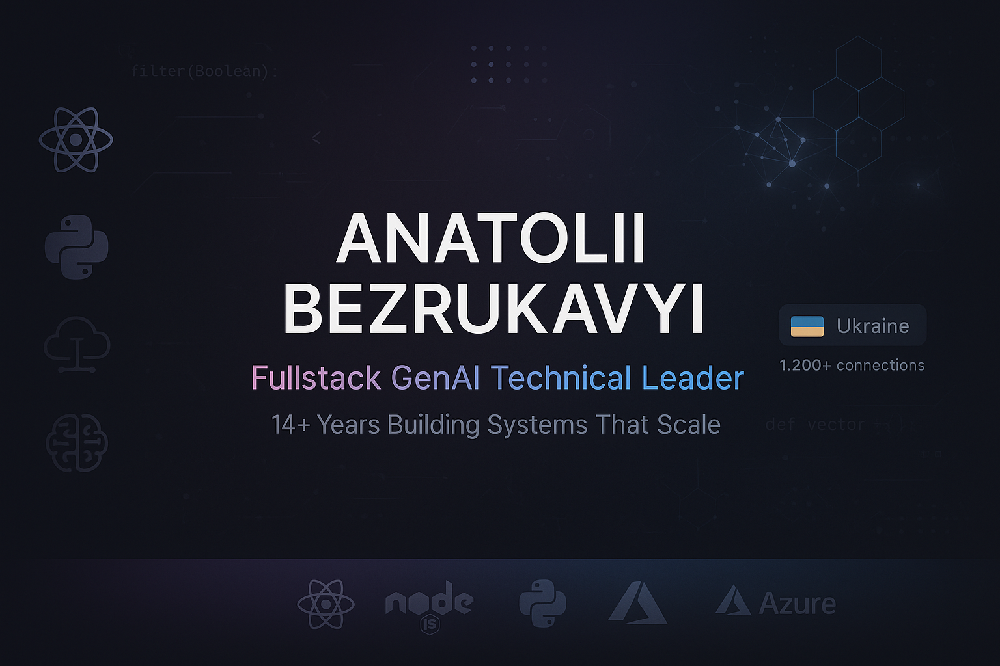
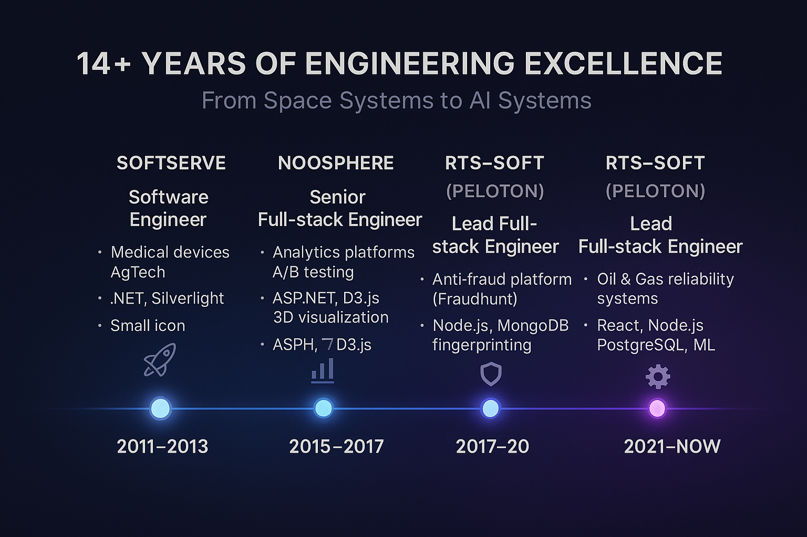
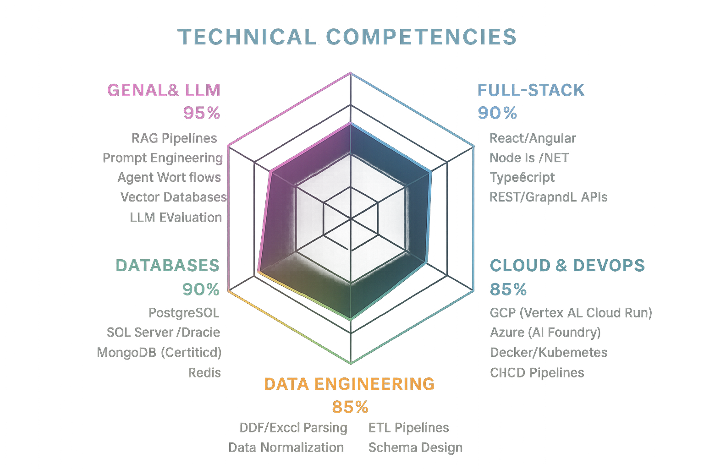
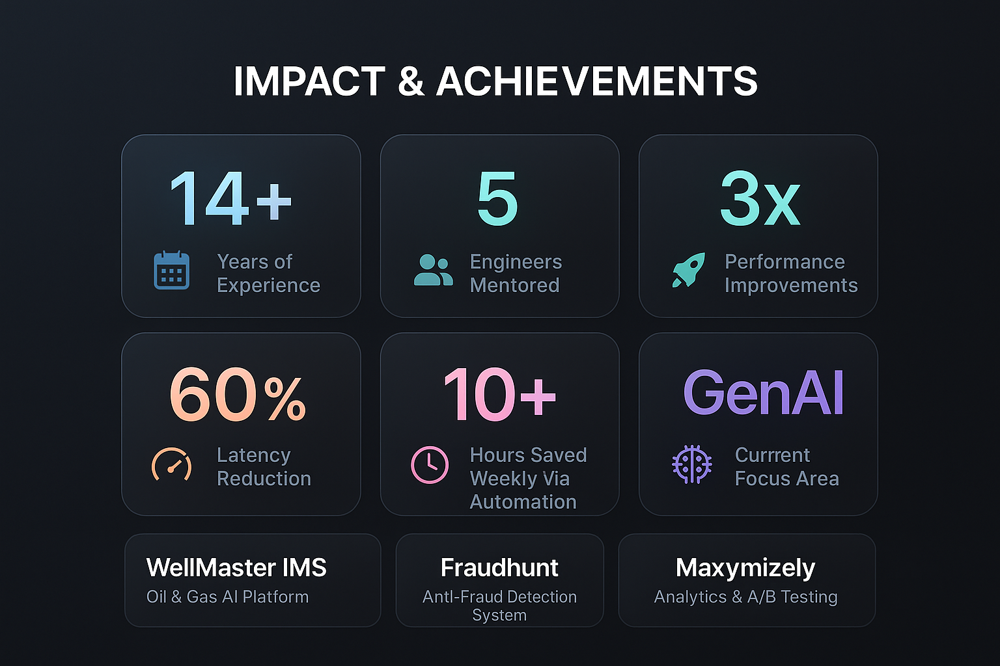
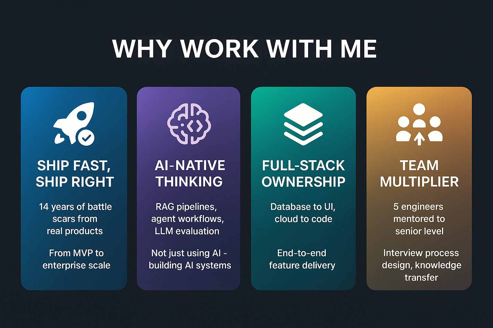

# Anatolii Bezrukavyi

**Fullstack GenAI Technical Leader** · **14+ Years of Engineering Excellence**

*Building systems that scale. Leading teams that ship.*

---

## TL;DR

> **I'm a Full-Stack GenAI Technical Leader with 14+ years of battle scars from shipping real products.** I've migrated monoliths to microservices, built AI agents from scratch, mentored engineers to senior level, and reduced system latencies from minutes to milliseconds. Currently deep in RAG pipelines, LLM evaluation, and agentic workflows — the stuff that makes AI actually work in production.

---

## The Journey: From Space Systems to AI Systems

### The Origin Story

I started my career with a **Master's degree in Spacecraft Power Systems** — designing electric propulsion and power generators for satellites. That background gave me something invaluable: **systems thinking**. Whether it's a satellite or a SaaS platform, the principles are the same — reliability, efficiency, graceful degradation, and knowing that failure isn't an option when you can't just "restart the server."

### Career Progression

| Period | Company | Role | Focus |
|--------|---------|------|-------|
| **2021–Now** | RTS-Soft (Peloton) | GenAI Technical Leader | AI agents, RAG, LLM ops, cloud architecture |
| **2017–2021** | RTS-Soft (Peloton) | Lead Full-Stack Engineer | React, Node.js, ML integration, team mentorship |
| **2015–2017** | Noosphere | Lead Full-Stack Engineer | Anti-fraud platform, fingerprinting, high-load systems |
| **2013–2015** | Noosphere | Senior Full-Stack Engineer | Analytics platforms, A/B testing, 3D visualization |
| **2011–2013** | SoftServe | Software Engineer | Medical devices, AgTech, .NET foundations |

---

## What I Actually Do

### GenAI & LLM Engineering (Current Focus)

This is where I live now. Not just "using GPT-4" — **building production AI systems**:

- **RAG Pipelines**: Vector store design (chunking strategies, embedding selection, metadata filtering), retrieval optimization, hybrid search
- **Agent Workflows**: Custom agentic architectures, tool/skill design, prompt orchestration, guardrails
- **LLM Evaluation**: Automated eval frameworks, dataset preparation, regression detection, hallucination monitoring
- **Observability**: Structured traces/logs for LLM calls, experiment tracking, cost monitoring

### Full-Stack Development

The foundation that makes everything else possible:

| Layer | Technologies | Experience |
|-------|--------------|------------|
| **Frontend** | React, Angular, TypeScript, D3.js, WebGL | 10+ years |
| **Backend** | Node.js, .NET Core, Python, REST/GraphQL | 14+ years |
| **Databases** | PostgreSQL, SQL Server, Oracle, MongoDB (Certified), Redis | 14+ years |
| **Cloud** | GCP (Vertex AI, Cloud Run), Azure (AI Foundry), AWS | 8+ years |
| **DevOps** | Docker, Kubernetes, Terraform, CI/CD, GitHub Actions | 6+ years |

### Leadership & Process

Not just code — **teams and systems**:

- Mentored **5 engineers** from mid-level to senior
- Designed **technical interview processes** (.NET, JavaScript, system design)
- Built **code review guidelines** and automated testing frameworks
- Led **Oracle → PostgreSQL** and **Oracle → SQL Server** migrations
- Established **feature-flagged CI/CD** with security gates

---

## Impact & Achievements

### By The Numbers

| Metric | Achievement | Context |
|--------|-------------|---------|
| **3x** | Performance improvement | Real-time data pipeline migration to cloud-ready architecture |
| **60%** | Latency reduction | React/D3.js dashboard for IoT anomaly detection |
| **Minutes → Milliseconds** | Workflow optimization | Core workflow re-architecture at Peloton |
| **10+ hours/week** | Automation savings | Automated reporting and risk ranking workflows |
| **5 engineers** | Mentored to senior | Career development, technical growth |

### Key Projects

#### 🛢️ WellMaster IMS (2021–Present)
**Oil & Gas AI Platform** — [peloton.com/wellmaster-ims](https://www.peloton.com/products/integrity-and-reliability/wellmaster-ims)

- Built **GenAI review agent** with prompt orchestration and auto-quality checks
- Designed **vector-store pipelines** (chunking, embeddings, metadata filters)
- Created **Python utilities** for XML/Excel/PDF normalization for RAG
- Migrated **real-time historian data pipelines** to cloud-ready architecture
- **Azure + GCP** infrastructure (Vertex AI, Cloud Run, AI Foundry)

#### 🛡️ Fraudhunt (2015–2017)
**Anti-Fraud Detection Platform** — [fraudhunt.net](https://fraudhunt.net/)

- Designed **full backend/frontend architecture**
- Built **lightweight fingerprinting** and probabilistic matching
- Migrated high-load services to **nginx**, optimized **MongoDB** queries
- Adopted **Vertica** for advanced analytics
- **Fuzzy logic** fraud detection with multiple signal correlation

#### 📊 Maxymizely (2013–2015)
**Analytics & A/B Testing Platform** — [maxymizely.com](http://eu.maxymizely.com/)

- Built **3D analytics visualization** with WebGL
- Implemented **reusable A/B testing framework**
- Created **D3.js heat-map charts** and real-time dashboards
- Performance optimization for high-traffic analytics

---

## Why Work With Me

### For ComplexChaos Specifically

Reading the job description, here's what maps directly:

| Your Need | My Experience |
|-----------|---------------|
| *"TypeScript/Node.js backends"* | 10+ years Node.js, TypeScript across multiple production systems |
| *"Vue → Next.js migration"* | Multiple migration projects (Oracle→Postgres, monolith→microservices) |
| *"Python AI services"* | Current role: Python for RAG pipelines, eval scripts, data processing |
| *"AI-powered experiences"* | Built GenAI review agents, vector stores, prompt orchestration |
| *"OpenAI APIs, embeddings"* | Daily work: embedding strategies, retrieval tuning, LLM evaluation |
| *"Monolith to microservices"* | Led architecture refactoring, service boundary design |
| *"Enterprise clients"* | Peloton (oil & gas), medical devices, fraud detection — high stakes |
| *"Mentor junior engineers"* | 5 engineers mentored, interview process design |

### What I Bring to the Table

1. **Battle-Tested Shipping Experience**
   - Not just prototypes — production systems with real users and real consequences
   - "It works on my machine" never cut it in medical devices or oil & gas

2. **AI-Native Thinking**
   - I don't just call APIs — I design evaluation frameworks, tune retrieval, debug why GPT-4 suddenly gives weird responses
   - RAG isn't magic to me — it's engineering with specific tradeoffs

3. **Full Ownership Mentality**
   - Database schema to UI interactions to cloud deployment
   - I don't throw work over the fence — I own the outcome

4. **Team Multiplier Effect**
   - I've built interview processes, mentored engineers, established code review cultures
   - I make teams better, not just codebases

---

## The Honest Parts

### What I'm Great At
- **Building AI systems that actually work** (not just demos)
- **Migrations and modernization** without breaking everything
- **Making complex things simple** (architecturally and in communication)
- **Getting stuff shipped** while maintaining quality

### What I'm Still Learning
- **Next.js specifically** (React expert, Next.js learning curve is manageable)
- **Your specific domain** (climate/consensus is new, but I've learned oil & gas, fraud, medical)
- **Startup pace** (enterprise background, but I adapt fast)

### What I Value
- **Impact over activity** — shipping features users want
- **Honest engineering** — acknowledging tradeoffs, not hiding complexity
- **Teams over heroes** — sustainable systems and knowledge sharing
- **Craft** — code that's readable, tested, and maintainable

---

## Let's Talk

### Ready for a conversation?

| Channel | Link |
|---------|------|
| 📧 **Email** | [abezr88@gmail.com](mailto:abezr88@gmail.com) |
| 💼 **LinkedIn** | [linkedin.com/in/anatolii-bezrukavyi-b2803a73](https://www.linkedin.com/in/anatolii-bezrukavyi-b2803a73) |
| 📱 **WhatsApp** | +38 (095) 815-9416 |
| 📄 **Full CV** | [Google Docs](https://docs.google.com/document/d/12sytqSc3zmXFyfPC41AId7ZcKqe3FCyT) |

---

### Quick Facts

| | |
|---|---|
| **Location** | Lviv, Ukraine 🇺🇦 |
| **Experience** | 14+ years |
| **Current Focus** | GenAI / LLM Engineering |
| **Education** | MSc Spacecraft Power Systems |
| **Languages** | English (Professional), Ukrainian (Native) |

---

*"I don't just write code. I build systems that scale and teams that ship."*

---

## Appendix: Certifications & Education

### Certifications
- **MongoDB Certified** (10gen)
- **English Proficiency** (Duolingo, 2024)
- **Pattern-Oriented Software Architectures** (Coursera/Vanderbilt, 2013)
- **ASP.NET 4.0, C# 4.0, JavaScript 1.8** (Brainbench)

### Education
- **MSc Spacecraft Power Systems** — Oles Honchar Dnipro National University (2009-2011)
- **BSc Spacecraft Power Systems** — Oles Honchar Dnipro National University (2005-2009)
- **Pattern-Oriented Architectures** — Vanderbilt University / Coursera (2013)
- **Web Development (.NET)** — SoftServe IT-Academy (2011)

---

*Last updated: December 2024*

**[← Back to Main Documentation](./README.md)**

