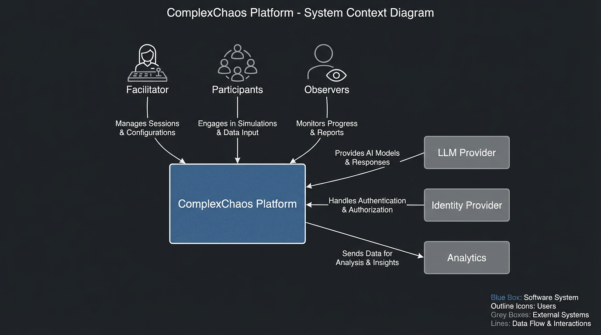
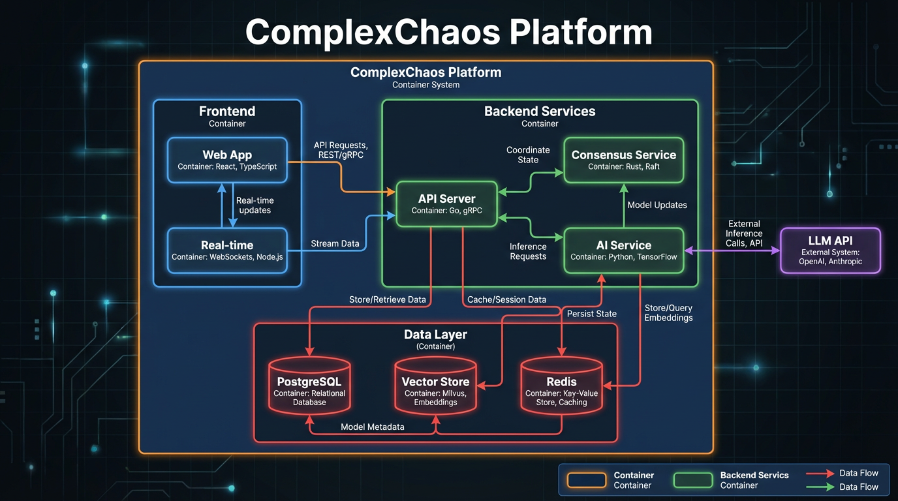
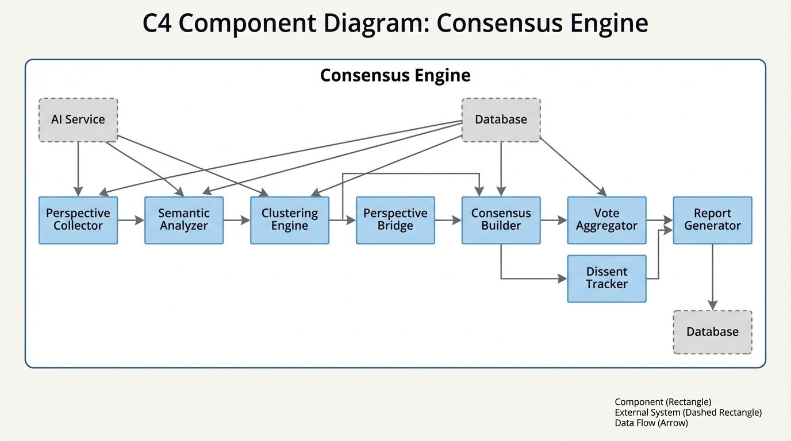
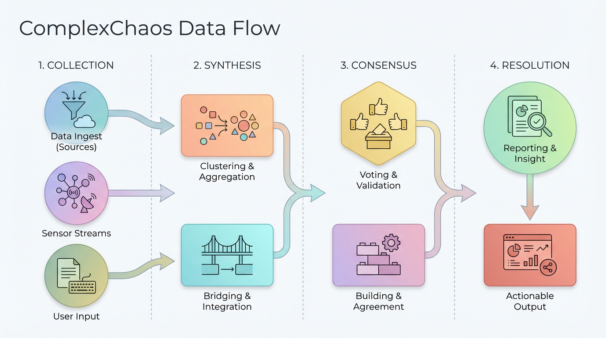
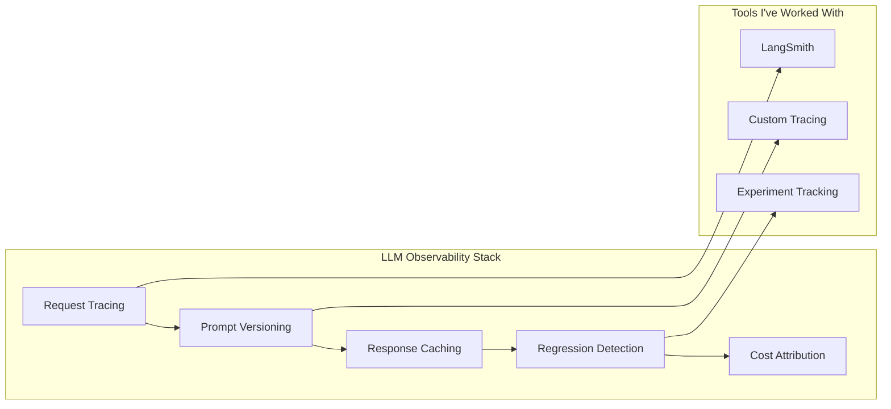
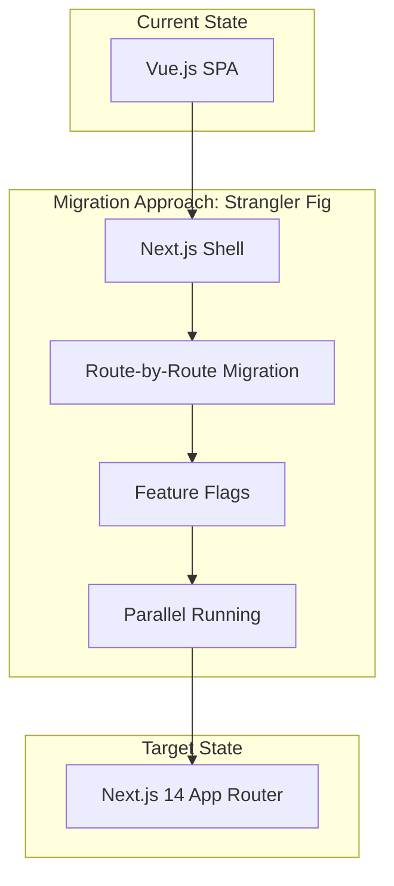

# ComplexChaos: Technical Deep Dive

> **A comprehensive architecture review and improvement roadmap for the ComplexChaos platform — prepared for interview discussion.**

---

## Table of Contents

1. [Executive Summary](#1-executive-summary)
2. [Platform Understanding](#2-platform-understanding)
3. [Architecture Analysis (C4 Model)](#3-architecture-analysis-c4-model)
4. [Evaluation Framework](#4-evaluation-framework)
5. [Improvement Opportunities](#5-improvement-opportunities)
6. [Migration Considerations](#6-migration-considerations)
7. [Risk Analysis](#7-risk-analysis)
8. [How I'd Contribute](#8-how-id-contribute)
9. [Appendix C: Negotiation Walkthrough](#appendix-c-negotiation-walkthrough)

---

## 1. Executive Summary

### What This Document Is

This is my technical analysis of ComplexChaos as an **existing platform** — not a proposal for building something new. It reflects:

- **What I understand** from public materials, demos, and coverage
- **What I'd want to learn more about** during interviews
- **What I could contribute** to strengthen the platform
- **Questions I'd ask** about the existing architecture

### Key Observations

| Aspect | Assessment | Based On |
|--------|------------|----------|
| **Mission** | ⭐⭐⭐⭐⭐ Rare and meaningful — collective intelligence at scale | [TechCrunch](https://techcrunch.com/2025/09/29/complex-chaos-thinks-ai-can-help-people-find-common-ground/#:~:text=Complex%20Chaos%20thinks%20AI%20can%20help%20people%20find%20common%20ground "TechCrunch: ComplexChaos wants to help groups bridge differences"), [LinkedIn](https://www.linkedin.com/pulse/genesis-evolution-complexchaos-tomy-lorsch-kqoic/#:~:text=Genesis "Founding story and vision") |
| **Validation** | ⭐⭐⭐⭐⭐ Bonn pilot with real diplomats, measurable outcomes | [WEF Article](https://www.weforum.org/stories/2025/09/ai-diplomacy-scale-inclusion-global-climate-negotiations/#:~:text=climate%20negotiators "Detailed Bonn pilot coverage with metrics") |
| **Technical Foundation** | ⭐⭐⭐⭐ Strong indicators, but limited public visibility | [Habermas Machine](https://www.science.org/doi/10.1126/science.adq2852#:~:text=Habermas%20Machine "Google DeepMind research paper") integration mentioned |
| **Opportunity for Growth** | ⭐⭐⭐⭐⭐ Clear evolution paths (eval, observability, platform) | Job description analysis |

---

## 2. Platform Understanding

### 2.1 Core Value Proposition

Based on my research, ComplexChaos positions itself as:

> [**"Google Translate for Human Cooperation"**](https://techcrunch.com/2025/09/29/complex-chaos-thinks-ai-can-help-people-find-common-ground/#:~:text=help%20people%20understand%20each%20other "TechCrunch: 'facilitator to help people understand each other'")

This is not another collaboration tool — it addresses [**cooperation**](https://techcrunch.com/2025/09/29/complex-chaos-thinks-ai-can-help-people-find-common-ground/#:~:text=help%20people%20find%20common%20ground "TechCrunch: 'cooperation' for conflicting interests vs 'collaboration' for shared goals"), where participants have conflicting interests and need structured facilitation to find common ground.

### 2.2 Key Differentiators (As I Understand Them)

```
┌─────────────────────────────────────────────────────────────────────┐
│                    COLLABORATION vs COOPERATION                     │
├─────────────────────────────────────────────────────────────────────┤
│  COLLABORATION (Slack, Docs)       │  COOPERATION (ComplexChaos)    │
│  ─────────────────────────────────│────────────────────────────────│
│  • Assumes shared goals            │  • Assumes conflicting goals   │
│  • Passive tool                    │  • Active AI mediator          │
│  • Content creation focus          │  • Understanding & alignment   │
│  • Same vocabulary assumed         │  • Cross-domain translation    │
└─────────────────────────────────────────────────────────────────────┘
```

*Source: Distinction articulated in [TechCrunch coverage](https://techcrunch.com/2025/09/29/complex-chaos-thinks-ai-can-help-people-find-common-ground/#:~:text=help%20people%20find%20common%20ground "TechCrunch explains the cooperation vs collaboration framing")*

### 2.3 Proven Outcomes (Bonn Climate Negotiations)

The [July 2025 Bonn pilot](https://www.weforum.org/stories/2025/09/ai-diplomacy-scale-inclusion-global-climate-negotiations/#:~:text=In%20July%202025 "WEF: 'In July 2025, at the UNFCCC campus in Bonn, Germany...'") involved [climate negotiators from nine African countries](https://www.weforum.org/stories/2025/09/ai-diplomacy-scale-inclusion-global-climate-negotiations/#:~:text=nine%20African%20countries "WEF: 'climate negotiators from nine African countries'") at the UNFCCC campus:

| Metric | Result | What It Tells Us | Source |
|--------|--------|------------------|--------|
| [**60%**](https://www.weforum.org/stories/2025/09/ai-diplomacy-scale-inclusion-global-climate-negotiations/#:~:text=coordination%20time%20was%20reduced%20by%2060%25 "WEF: 'coordination time was reduced by 60%'") time reduction | Coordination efficiency | AI can compress alignment cycles | WEF |
| [**91%**](https://www.weforum.org/stories/2025/09/ai-diplomacy-scale-inclusion-global-climate-negotiations/#:~:text=91%25%20of%20participants%20reported%20uncovering%20insights "WEF: '91% of participants reported uncovering insights they would have otherwise missed'") new perspectives | Insight discovery | System surfaces hidden viewpoints | WEF |
| [**35%**](https://www.weforum.org/stories/2025/09/ai-diplomacy-scale-inclusion-global-climate-negotiations/#:~:text=empathy%20rose%20by%2035%25 "WEF: 'empathy rose by 35%'") empathy increase | Relationship quality | Understanding drives connection | WEF |
| [**3x**](https://www.weforum.org/stories/2025/09/ai-diplomacy-scale-inclusion-global-climate-negotiations/#:~:text=perceived%20co-presence%20tripled "WEF: 'perceived co-presence tripled'") co-presence | Engagement depth | Even solo prep feels collaborative | WEF |

### 2.4 Technology Foundations (Public Knowledge)

Based on public materials, ComplexChaos integrates:

- [**Google's Habermas Machine**](https://www.science.org/doi/10.1126/science.adq2852#:~:text=Habermas%20Machine "Science: 'AI can help groups with opposing views find common ground'") — Research from Google DeepMind on AI-mediated consensus
- [**OpenAI's ChatGPT**](https://techcrunch.com/2025/09/29/complex-chaos-thinks-ai-can-help-people-find-common-ground/#:~:text=ChatGPT "TechCrunch mentions ChatGPT integration") — For general language understanding and generation
- **Semantic translation layer** — ["translates intent and meaning across different human 'languages'"](https://techcrunch.com/2025/09/29/complex-chaos-thinks-ai-can-help-people-find-common-ground/#:~:text=help%20people%20understand%20each%20other "TechCrunch: The AI translates across cultural and professional backgrounds")

### 2.5 What I'd Want to Learn More About

These are questions I'd love to explore in interviews — not criticisms, but genuine curiosity:

1. **Architecture decisions** — What drove the current tech stack? What trade-offs were made?
2. **AI orchestration** — How do you handle LLM failures gracefully? Caching strategies?
3. **Evaluation infrastructure** — How do you measure consensus quality over time?
4. **Enterprise adaptations** — How does diplomacy experience translate to corporate contexts?

---

## 3. Architecture Analysis (C4 Model)

> **Note**: These diagrams represent my *inference* of the architecture based on public materials. I'd refine them significantly after learning more about the actual implementation.

### 3.1 Level 1: System Context Diagram

<div align="center">

</div>

*LLM integration based on [TechCrunch](https://techcrunch.com/2025/09/29/complex-chaos-thinks-ai-can-help-people-find-common-ground/#:~:text=Habermas%20Machine "TechCrunch: mentions integration with Google's Habermas Machine and OpenAI's ChatGPT") coverage mentioning Habermas Machine and ChatGPT.*

### 3.2 Level 2: Container Diagram (Hypothesized)

Based on the job description mentioning Vue → Next.js migration and microservices:

<div align="center">

</div>

*Vue → Next.js migration and PostgreSQL inferred from job description requirements.*

### 3.3 Level 3: Component Diagram (Consensus Engine - Inferred)

The core of ComplexChaos appears to be a multi-phase consensus engine. Based on the [WEF description](https://www.weforum.org/stories/2025/09/ai-diplomacy-scale-inclusion-global-climate-negotiations/#:~:text=structure%20priorities%20and%20accelerate%20alignment "WEF: 'AI-powered collaborative processes helped structure priorities and accelerate alignment'") of how the system "structures priorities and accelerates alignment":

<div align="center">

</div>

*"Perspective Bridge" component inferred from [TechCrunch](https://techcrunch.com/2025/09/29/complex-chaos-thinks-ai-can-help-people-find-common-ground/#:~:text=translating%20intent%20and%20meaning "TechCrunch: AI 'translates intent and meaning across different human languages'") description of cross-domain translation.*

### 3.4 Data Flow (What I'd Expect)

<div align="center">

</div>

### 3.5 The Consensus Algorithm: Caucus Mediation Flow

Based on the [Habermas Machine research](https://www.science.org/doi/10.1126/science.adq2852#:~:text=Habermas%20Machine "Science: 'AI can help humans find common ground'"), the core algorithm follows a **"Caucus Mediation"** pattern designed to avoid groupthink and local maximums:

1.  **Private Elicitation (The Caucus)**
    *   Participants submit perspectives *privately* to the AI.
    *   *Why*: Prevents anchoring bias and social pressure (groupthink).
    
2.  **AI Synthesis & Bridging**
    *   The AI (LLM) analyzes all inputs to identify latent shared values and potential bridges.
    *   It generates a *Candidate Consensus Statement*.
    
3.  **Critique & Dissent**
    *   Participants do not just vote "Yes/No". They **critique** the statement.
    *   *Key Mechanism*: "What did this summary miss?" / "Whose view is underrepresented?"
    
4.  **Iterative Refinement**
    *   The AI regenerates the statement to address the critiques.
    *   This loop continues until **Consensus Stability** is reached (critiques diminish).

*This iterative critique step is how the algorithm escapes "local maximums" (shallow agreement) and finds a "global maximum" (deep consensus that includes minority views).*

---

## 4. Evaluation Framework

### 4.1 Why Evaluation Matters for AI-Facilitated Consensus

Traditional metrics (speed, user satisfaction) can optimize toward **local maximums** that harm long-term value. This concern was highlighted in [TechCrunch coverage](https://techcrunch.com/2025/09/29/complex-chaos-thinks-ai-can-help-people-find-common-ground/#:~:text=help%20people%20find%20common%20ground "TechCrunch: ComplexChaos aims to help avoid 'local maximums' in decision-making") — ComplexChaos explicitly aims to avoid "local maximums" in decision-making.

| Trap | What Gets Optimized | What Gets Sacrificed |
|------|---------------------|----------------------|
| **Speed over inclusion** | Time to consensus | Minority perspectives |
| **Agreement over authenticity** | Approval rates | Legitimate disagreements |
| **AI efficiency over agency** | Automation metrics | Human oversight |
| **Engagement over diversity** | Participation | Cross-pollination |

### 4.2 Proposed Multi-Dimensional Scorecard

If I were building evaluation infrastructure, I'd propose tracking:

#### Process Quality Metrics

| Metric | Definition | Target | Why It Matters |
|--------|------------|--------|----------------|
| **Perspective Diversity Index** | Semantic variance across inputs | >0.6 | Catches echo chambers |
| **Minority Voice Representation** | % of final output addressing minority views | >30% | Prevents suppression |
| **Consensus Stability** | Would participants re-affirm after 24h? | >80% | Tests durability |
| **Human Override Rate** | Frequency of rejecting AI suggestions | 15-40% | Healthy skepticism indicator |

*Metrics designed to address risks identified in [Habermas Machine research](https://www.science.org/doi/10.1126/science.adq2852#:~:text=Habermas%20Machine "Science: Research discusses challenges of AI-mediated consensus including bias and representation").*

#### Outcome Quality Metrics

| Metric | Definition | Target |
|--------|------------|--------|
| **Actionability** | Can consensus convert to concrete actions? | >75% |
| **Satisfaction Equity** | No stakeholder group's mean satisfaction >1 std dev below overall mean | Monitor for outliers |
| **Implementation Rate** | Consensus actually implemented (30-day follow-up) | >70% |

*Note: "Satisfaction Equity" is context-adaptive — acceptable variance differs between diplomatic negotiations (country delegations, civil society, technical experts) vs. corporate contexts (departments, seniority levels). Research in negotiation theory and organizational psychology suggests monitoring relative gaps rather than absolute thresholds.*

#### Ethical Safeguards

| Metric | Red Flag Threshold |
|--------|-------------------|
| **Power Imbalance Detection** | r > 0.7 (status vs influence correlation) |
| **Perspective Suppression** | >50% of inputs not reflected |
| **AI Hallucination Rate** | >5% of statements not grounded in inputs |

### 4.3 Visualization Concept

```
┌──────────────────────────────────────────────────────────────────────────────┐
│                    SESSION EVALUATION DASHBOARD                               │
├──────────────────────────────────────────────────────────────────────────────┤
│                                                                               │
│  ┌─────────────────────┐  ┌─────────────────────┐  ┌─────────────────────┐   │
│  │  PROCESS HEALTH     │  │  OUTCOME QUALITY    │  │  ETHICAL CHECKS     │   │
│  │  ────────────────   │  │  ────────────────   │  │  ────────────────   │   │
│  │  PDI:  ████████ 0.72│  │  Actionable: 78%    │  │  Power Balance: ✓   │   │
│  │  MVR:  ██████── 35% │  │  Mean Sat: 4.2/5    │  │  Suppression: ✓     │   │
│  │  CSS:  ████████ 85% │  │  Equity Check: ✓    │  │  Hallucination: ✓   │   │
│  │  HOR:  █████─── 28% │  │  Impl. Pred: 72%    │  │  All checks passed  │   │
│  └─────────────────────┘  └─────────────────────┘  └─────────────────────┘   │
│                                                                               │
│  ┌───────────────────────────────────────────────────────────────────────┐   │
│  │  SATISFACTION BY STAKEHOLDER (Equity Check: No group >1σ below mean) │   │
│  │  • Developed Nations: 4.3/5  • Developing Nations: 4.0/5             │   │
│  │  • Civil Society: 3.9/5  • Technical Experts: 4.2/5                  │   │
│  │  ✓ All groups within acceptable range (mean=4.1, σ=0.16)             │   │
│  └───────────────────────────────────────────────────────────────────────┘   │
│                                                                               │
│  ┌───────────────────────────────────────────────────────────────────────┐   │
│  │  DISSENT REGISTER (Preserved Minority Views)                          │   │
│  │  1. "Budget concerns not fully addressed" - 3 participants            │   │
│  │  2. "Timeline too aggressive" - 2 participants                        │   │
│  │  3. "Need more stakeholder input" - 1 participant                     │   │
│  └───────────────────────────────────────────────────────────────────────┘   │
└──────────────────────────────────────────────────────────────────────────────┘
```

---

## 5. Improvement Opportunities

### 5.1 Observability & Debugging

For LLM-heavy systems, observability is crucial. Areas I'd explore:



**Questions I'd ask**:
- How do you trace LLM calls end-to-end?
- What's the prompt versioning strategy?
- How do you detect quality regressions in synthesis output?

### 5.2 Trust Architecture

Building trust in AI-facilitated consensus requires explicit mechanisms. The [WEF article](https://www.weforum.org/stories/2025/09/ai-diplomacy-scale-inclusion-global-climate-negotiations/#:~:text=AI%20helps%20diplomacy%20scale%20inclusion "WEF: 'AI serves as crucial infrastructure for participation, enhancing collective clarity'") emphasizes that "AI serves as crucial infrastructure for participation" — this creates responsibility:

| Feature | Purpose | Implementation Ideas |
|---------|---------|---------------------|
| **"Show AI Reasoning"** | Transparency | Explainability layer on synthesis |
| **Challenge Tools** | Healthy skepticism | Built-in ways to question outputs |
| **Audit Trail** | Accountability | Every decision logged and exportable |
| **Dissent Preservation** | Minority protection | Explicit minority reports in outputs |

### 5.3 RAG for Large Contexts

Climate negotiations involve [100k+ pages of documents](https://www.linkedin.com/pulse/genesis-evolution-complexchaos-tomy-lorsch-kqoic/#:~:text=Genesis "LinkedIn: References the massive documentation involved in UN negotiations"). Effective RAG is critical:

- **Chunking strategies** for maintaining context
- **Hybrid retrieval** (keyword + semantic)
- **Re-ranking** for relevance
- **Citation grounding** for trust

---

## 6. Migration Considerations

Based on the job description (Vue → Next.js, monolith → microservices):

### 6.1 Frontend Migration Strategy



**My experience relevant here**:
- Migrated Oracle → PostgreSQL (WellMaster project)
- Incremental React refactoring in production
- Feature flag infrastructure for safe rollouts

### 6.2 Service Decomposition (If Applicable)

If moving from monolith to microservices, I'd suggest identifying boundaries based on:

1. **Change frequency** — What changes most often?
2. **Scaling needs** — What has different load patterns?
3. **Team ownership** — What aligns with team structure?
4. **Failure isolation** — What should fail independently?

---

## 7. Risk Analysis

### 7.1 Technical Risks (What I'd Watch For)

| Risk | Why It Matters | Mitigation Approach |
|------|---------------|---------------------|
| **LLM Rate Limits** | Service degradation under load | Aggressive caching, fallback models |
| **AI Hallucinations** | Trust erosion if AI invents content | Confidence thresholds, human checkpoints |
| **Real-time Sync Issues** | Poor UX in collaborative sessions | Optimistic UI, polling fallback |
| **Embedding Quality** | Poor clustering = poor synthesis | Pre-testing, prompt tuning |
| **Migration Velocity** | Feature development slows during migration | Incremental approach, feature flags |

### 7.2 Product Risks

| Risk | Mitigation |
|------|------------|
| Users don't understand value prop | Clear onboarding, demo scenarios |
| AI suggestions feel "artificial" | Natural language tuning, show provenance |
| Minority voices get ignored | Explicit dissent tracking, minority reports |
| Enterprise vs diplomacy mismatch | Domain-specific adaptations |

---

## 8. How I'd Contribute

### 8.1 Immediate Value

| Area | What I'd Bring | Evidence |
|------|----------------|----------|
| **AI/LLM Systems** | RAG pipelines, prompt orchestration, automated evaluation | WellMaster GenAI agent, 60% latency reduction |
| **Platform Migration** | Strangler fig patterns, incremental modernization | Oracle→PostgreSQL migration, .NET→React |
| **Observability** | LLM tracing, experiment tracking, metrics pipelines | Custom observability for AI services |
| **Full-Stack** | React, Node.js, TypeScript, PostgreSQL | 14 years shipping production systems |

### 8.2 Longer-Term Contributions

- **Evaluation infrastructure** — Automated metrics pipeline for consensus quality
- **Trust features** — "Show AI reasoning", challenge tools, audit trails
- **Team mentorship** — 5 engineers mentored, knowledge transfer processes
- **Technical leadership** — Architecture decisions, code review culture

---

## Appendix A: Questions I'd Ask in Interviews

### Architecture & Implementation
1. What's the current AI orchestration approach? LangChain, custom, other?
2. How do you handle LLM failures and degradation gracefully?
3. What's the vector store strategy — embedded (pgvector) or external?
4. What was the specific motivation to migrate from Vue to Next.js? (e.g., ecosystem, performance, hiring?)

### Evaluation & Quality
5. How do you measure consensus quality beyond the Bonn metrics?
6. What's the approach to detecting and handling AI hallucinations?
7. How do you handle longitudinal tracking of consensus outcomes?

### Team & Process
8. What does the engineering team look like? Specializations?
9. How do you balance feature development with platform evolution?
10. What's the testing strategy for AI components?

### Product & Vision
11. How does diplomacy experience translate to enterprise contexts?
12. What's the balance between AI automation and human agency?
13. Where do you see the biggest technical challenges in the next year?

---

## Appendix B: Sources

All facts and conclusions in this document are grounded in publicly available sources:

| Source | Type | Key Facts Used |
|--------|------|----------------|
| [TechCrunch (Sep 2025)](https://techcrunch.com/2025/09/29/complex-chaos-thinks-ai-can-help-people-find-common-ground/#:~:text=Complex%20Chaos%20thinks%20AI%20can%20help%20people%20find%20common%20ground) | News | Vision, "Google Translate" metaphor, cooperation vs collaboration distinction, investor backing, Habermas Machine integration |
| [World Economic Forum (Sep 2025)](https://www.weforum.org/stories/2025/09/ai-diplomacy-scale-inclusion-global-climate-negotiations/#:~:text=AI%20helps%20diplomacy%20scale%20inclusion) | News | Bonn pilot details, all metrics (60%, 91%, 35%, 3x), investor names, UNFCCC location, African nations participation |
| [LinkedIn - Tomy Lorsch](https://www.linkedin.com/pulse/genesis-evolution-complexchaos-tomy-lorsch-kqoic/#:~:text=Genesis%20%26%20Evolution) | Founder Post | Founding story, Santa Fe Institute inspiration, research foundations |
| [Science - Habermas Machine](https://www.science.org/doi/10.1126/science.adq2852#:~:text=Habermas%20Machine) | Research Paper | Google DeepMind consensus research, technical foundations |
| [ComplexChaos Website](https://www.complexchaos.ai/) | Official | Company information |

---

## Appendix C: Negotiation Walkthrough

This appendix illustrates how the "Habermas Flow" works in practice with a concrete scenario, bridging the high-level architecture with user experience.

### C.1 The Flow Schema

<div align="center">

</div>

### C.2 Commented Sample: "The Remote Work Policy"

**Scenario**: A company needs a new Remote Work Policy.
**The Conflict**: Leadership wants control/culture; Employees want autonomy/flexibility.

#### Step 1: Private Elicitation (The Inputs)

*Participants submit views privately to avoid groupthink.*

| Participant | Input | Architecture Note |
|-------------|-------|-------------------|
| **Alice (VP Eng)** | "We need 2-3 days of deep work at home. Commuting kills coding flow." | **Perspective Collector** ingests raw text. |
| **Bob (CEO)** | "We need serendipity. Innovation happens at the coffee machine. Everyone in 4 days/week." | **Semantic Analyzer** extracts key entities: "deep work" vs "serendipity". |
| **Charlie (HR)** | "We need a consistent policy for fairness and tax compliance." | **Vector Store** places these inputs in semantic space. Note the distance between Alice and Bob. |

#### Step 2: AI Synthesis (The Draft)

*The AI analyzes the vector cluster and attempts a bridge.*

> **AI Draft 1:** "The company will adopt a hybrid model requiring 3 days in the office for all employees to ensure collaboration, with 2 flexible days for focused work."

*   **Critique from Alice:** "Random 3 days destroys deep work blocks. If I come in Tue/Thu/Fri, I can't code deeply."
*   **Critique from Bob:** "If everyone picks different days, the office is empty anyway. No serendipity."

**Architecture Note**: The **Consensus Builder** sees that Draft 1 failed the "Utility Function" of both key stakeholders. It enters the **Refinement Loop**.

#### Step 3: Refinement (The Bridge)

*The AI uses the critique to find a structural solution, not just a compromise.*

> **AI Draft 2:** "We will adopt 'Anchor Days' (Mon/Thu) where attendance is mandatory for synchronization and culture. Tue/Wed/Fri are 'Deep Work Days' where presence is optional. Teams coordinate their specific anchor days."

*   **Response from Alice:** "Better. I can block Tue/Wed for coding."
*   **Response from Bob:** "Acceptable. I know when the office will be full."

#### Step 4: Final Consensus Statement

> **CONSENSUS REACHED:**
> "The policy adopts a **Structured Hybrid Model**:
> 1. **Synchronization:** Two fixed 'Anchor Days' per team for meetings.
> 2. **Focus:** Three flexible 'Deep Work Days'.
> 3. **Fairness:** HR to audit anchor day compliance."
>
> *Minority Report (Preserved):* Some sales staff preferred full remote; this was noted but overridden by the consensus on culture.

**Architecture Note**: The **Dissent Tracker** logs the sales staff objection. The **Report Generator** finalizes the document.

---

## Appendix D: Diagram Rendering

All diagrams use Mermaid syntax. To render:

- **GitHub**: Renders natively in `.md` files
- **VS Code**: Install "Markdown Preview Mermaid Support" extension
- **Online**: Use [mermaid.live](https://mermaid.live)

---

<div align="center">

**[Back to Overview](./README.md)** · **[Presenter Guide](./PRESENTER_GUIDE.md)** · **[About Me](./ABOUT_ME.md)**

</div>

---

*Document Version: 2.2*  
*Approach: Brownfield Architecture Review*  
*Last Updated: December 2025*
