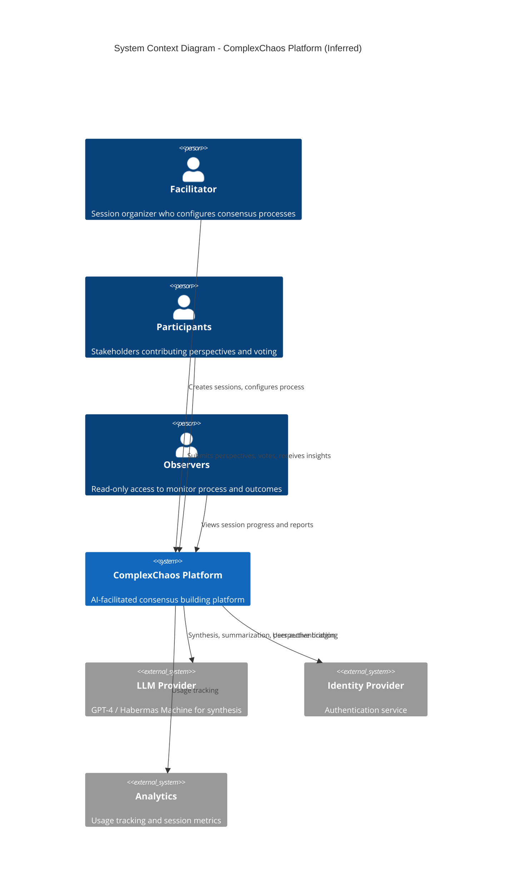
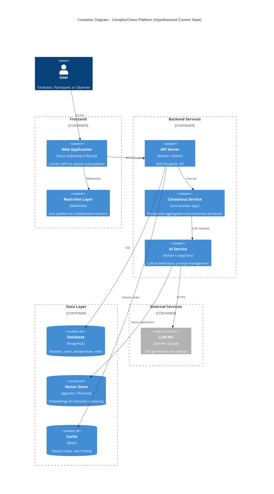
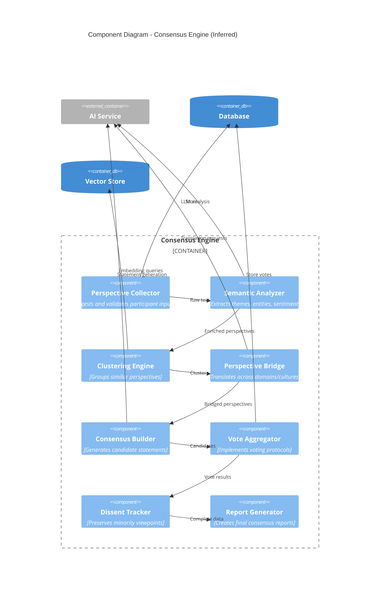
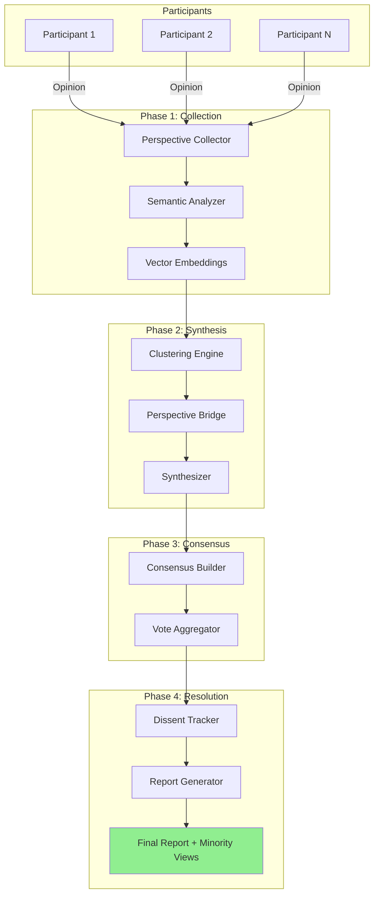
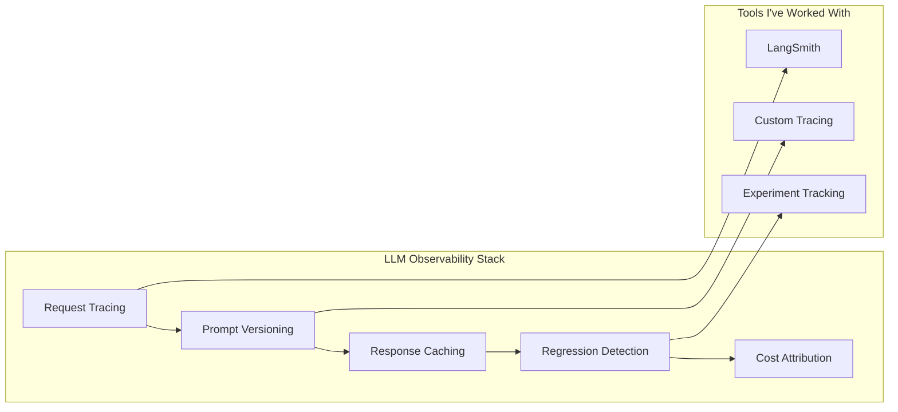
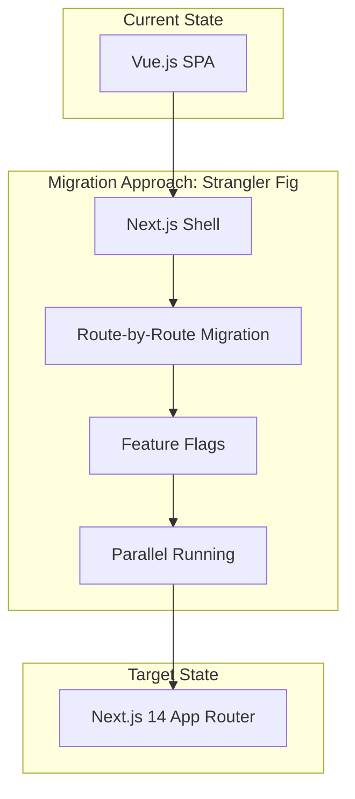

# ComplexChaos: Technical Deep Dive

> **A comprehensive architecture review and improvement roadmap for the ComplexChaos platform — prepared for interview discussion.**

---

## Table of Contents

1. [Executive Summary](#1-executive-summary)
2. [Platform Understanding](#2-platform-understanding)
3. [Architecture Analysis (C4 Model)](#3-architecture-analysis-c4-model)
4. [Evaluation Framework](#4-evaluation-framework)
5. [Improvement Opportunities](#5-improvement-opportunities)
6. [Migration Considerations](#6-migration-considerations)
7. [Risk Analysis](#7-risk-analysis)
8. [How I'd Contribute](#8-how-id-contribute)

---

## 1. Executive Summary

### What This Document Is

This is my technical analysis of ComplexChaos as an **existing platform** — not a proposal for building something new. It reflects:

- **What I understand** from public materials, demos, and coverage
- **What I'd want to learn more about** during interviews
- **What I could contribute** to strengthen the platform
- **Questions I'd ask** about the existing architecture

### Key Observations

| Aspect | Assessment |
|--------|------------|
| **Mission** | ⭐⭐⭐⭐⭐ Rare and meaningful — collective intelligence at scale |
| **Validation** | ⭐⭐⭐⭐⭐ Bonn pilot with real diplomats, measurable outcomes |
| **Technical Foundation** | ⭐⭐⭐⭐ Strong indicators, but limited public visibility |
| **Opportunity for Growth** | ⭐⭐⭐⭐⭐ Clear evolution paths (eval, observability, platform) |

---

## 2. Platform Understanding

### 2.1 Core Value Proposition

Based on my research, ComplexChaos positions itself as:

> **"Google Translate for Human Cooperation"**

This is not another collaboration tool — it addresses **cooperation**, where participants have conflicting interests and need structured facilitation to find common ground.

### 2.2 Key Differentiators (As I Understand Them)

```
┌─────────────────────────────────────────────────────────────────────┐
│                    COLLABORATION vs COOPERATION                     │
├─────────────────────────────────────────────────────────────────────┤
│  COLLABORATION (Slack, Docs)       │  COOPERATION (ComplexChaos)    │
│  ─────────────────────────────────│────────────────────────────────│
│  • Assumes shared goals            │  • Assumes conflicting goals   │
│  • Passive tool                    │  • Active AI mediator          │
│  • Content creation focus          │  • Understanding & alignment   │
│  • Same vocabulary assumed         │  • Cross-domain translation    │
└─────────────────────────────────────────────────────────────────────┘
```

### 2.3 Proven Outcomes (Bonn Climate Negotiations)

| Metric | Result | What It Tells Us |
|--------|--------|------------------|
| **60%** time reduction | Coordination efficiency | AI can compress alignment cycles |
| **91%** new perspectives | Insight discovery | System surfaces hidden viewpoints |
| **35%** empathy increase | Relationship quality | Understanding drives connection |
| **3x** co-presence | Engagement depth | Even solo prep feels collaborative |

### 2.4 What I'd Want to Learn More About

These are questions I'd love to explore in interviews — not criticisms, but genuine curiosity:

1. **Architecture decisions** — What drove the current tech stack? What trade-offs were made?
2. **AI orchestration** — How do you handle LLM failures gracefully? Caching strategies?
3. **Evaluation infrastructure** — How do you measure consensus quality over time?
4. **Enterprise adaptations** — How does diplomacy experience translate to corporate contexts?

---

## 3. Architecture Analysis (C4 Model)

> **Note**: These diagrams represent my *inference* of the architecture based on public materials. I'd refine them significantly after learning more about the actual implementation.

### 3.1 Level 1: System Context Diagram



### 3.2 Level 2: Container Diagram (Hypothesized)

Based on the job description mentioning Vue → Next.js migration and microservices:



### 3.3 Level 3: Component Diagram (Consensus Engine - Inferred)

The core of ComplexChaos appears to be a multi-phase consensus engine:



### 3.4 Data Flow (What I'd Expect)



---

## 4. Evaluation Framework

### 4.1 Why Evaluation Matters for AI-Facilitated Consensus

Traditional metrics (speed, user satisfaction) can optimize toward **local maximums** that harm long-term value. For consensus building, this is particularly dangerous:

| Trap | What Gets Optimized | What Gets Sacrificed |
|------|---------------------|----------------------|
| **Speed over inclusion** | Time to consensus | Minority perspectives |
| **Agreement over authenticity** | Approval rates | Legitimate disagreements |
| **AI efficiency over agency** | Automation metrics | Human oversight |
| **Engagement over diversity** | Participation | Cross-pollination |

### 4.2 Proposed Multi-Dimensional Scorecard

If I were building evaluation infrastructure, I'd propose tracking:

#### Process Quality Metrics

| Metric | Definition | Target | Why It Matters |
|--------|------------|--------|----------------|
| **Perspective Diversity Index** | Semantic variance across inputs | >0.6 | Catches echo chambers |
| **Minority Voice Representation** | % of final output addressing minority views | >30% | Prevents suppression |
| **Consensus Stability** | Would participants re-affirm after 24h? | >80% | Tests durability |
| **Human Override Rate** | Frequency of rejecting AI suggestions | 15-40% | Healthy skepticism indicator |

#### Outcome Quality Metrics

| Metric | Definition | Target |
|--------|------------|--------|
| **Actionability** | Can consensus convert to concrete actions? | >75% |
| **Satisfaction Variance** | Std dev of satisfaction across roles | <0.5 |
| **Implementation Rate** | Consensus actually implemented (30-day follow-up) | >70% |

#### Ethical Safeguards

| Metric | Red Flag Threshold |
|--------|-------------------|
| **Power Imbalance Detection** | r > 0.7 (status vs influence correlation) |
| **Perspective Suppression** | >50% of inputs not reflected |
| **AI Hallucination Rate** | >5% of statements not grounded in inputs |

### 4.3 Visualization Concept

```
┌──────────────────────────────────────────────────────────────────────────────┐
│                    SESSION EVALUATION DASHBOARD                               │
├──────────────────────────────────────────────────────────────────────────────┤
│                                                                               │
│  ┌─────────────────────┐  ┌─────────────────────┐  ┌─────────────────────┐   │
│  │  PROCESS HEALTH     │  │  OUTCOME QUALITY    │  │  ETHICAL CHECKS     │   │
│  │  ────────────────   │  │  ────────────────   │  │  ────────────────   │   │
│  │  PDI:  ████████ 0.72│  │  Actionable: 78%    │  │  Power Balance: ✓   │   │
│  │  MVR:  ██████── 35% │  │  Satisfaction: 4.2  │  │  Suppression: ✓     │   │
│  │  CSS:  ████████ 85% │  │  Impl. Pred: 72%    │  │  Hallucination: ✓   │   │
│  │  HOR:  █████─── 28% │  │  Variance: 0.3      │  │  All checks passed  │   │
│  └─────────────────────┘  └─────────────────────┘  └─────────────────────┘   │
│                                                                               │
│  ┌───────────────────────────────────────────────────────────────────────┐   │
│  │  DISSENT REGISTER (Preserved Minority Views)                          │   │
│  │  1. "Budget concerns not fully addressed" - 3 participants            │   │
│  │  2. "Timeline too aggressive" - 2 participants                        │   │
│  │  3. "Need more stakeholder input" - 1 participant                     │   │
│  └───────────────────────────────────────────────────────────────────────┘   │
└──────────────────────────────────────────────────────────────────────────────┘
```

---

## 5. Improvement Opportunities

### 5.1 Observability & Debugging

For LLM-heavy systems, observability is crucial. Areas I'd explore:



**Questions I'd ask**:
- How do you trace LLM calls end-to-end?
- What's the prompt versioning strategy?
- How do you detect quality regressions in synthesis output?

### 5.2 Trust Architecture

Building trust in AI-facilitated consensus requires explicit mechanisms:

| Feature | Purpose | Implementation Ideas |
|---------|---------|---------------------|
| **"Show AI Reasoning"** | Transparency | Explainability layer on synthesis |
| **Challenge Tools** | Healthy skepticism | Built-in ways to question outputs |
| **Audit Trail** | Accountability | Every decision logged and exportable |
| **Dissent Preservation** | Minority protection | Explicit minority reports in outputs |

### 5.3 RAG for Large Contexts

Climate negotiations involve 100k+ pages of documents. Effective RAG is critical:

- **Chunking strategies** for maintaining context
- **Hybrid retrieval** (keyword + semantic)
- **Re-ranking** for relevance
- **Citation grounding** for trust

---

## 6. Migration Considerations

Based on the job description (Vue → Next.js, monolith → microservices):

### 6.1 Frontend Migration Strategy



**My experience relevant here**:
- Migrated Oracle → PostgreSQL (WellMaster project)
- Incremental React refactoring in production
- Feature flag infrastructure for safe rollouts

### 6.2 Service Decomposition (If Applicable)

If moving from monolith to microservices, I'd suggest identifying boundaries based on:

1. **Change frequency** — What changes most often?
2. **Scaling needs** — What has different load patterns?
3. **Team ownership** — What aligns with team structure?
4. **Failure isolation** — What should fail independently?

---

## 7. Risk Analysis

### 7.1 Technical Risks (What I'd Watch For)

| Risk | Why It Matters | Mitigation Approach |
|------|---------------|---------------------|
| **LLM Rate Limits** | Service degradation under load | Aggressive caching, fallback models |
| **AI Hallucinations** | Trust erosion if AI invents content | Confidence thresholds, human checkpoints |
| **Real-time Sync Issues** | Poor UX in collaborative sessions | Optimistic UI, polling fallback |
| **Embedding Quality** | Poor clustering = poor synthesis | Pre-testing, prompt tuning |
| **Migration Velocity** | Feature development slows during migration | Incremental approach, feature flags |

### 7.2 Product Risks

| Risk | Mitigation |
|------|------------|
| Users don't understand value prop | Clear onboarding, demo scenarios |
| AI suggestions feel "artificial" | Natural language tuning, show provenance |
| Minority voices get ignored | Explicit dissent tracking, minority reports |
| Enterprise vs diplomacy mismatch | Domain-specific adaptations |

---

## 8. How I'd Contribute

### 8.1 Immediate Value

| Area | What I'd Bring | Evidence |
|------|----------------|----------|
| **AI/LLM Systems** | RAG pipelines, prompt orchestration, automated evaluation | WellMaster GenAI agent, 60% latency reduction |
| **Platform Migration** | Strangler fig patterns, incremental modernization | Oracle→PostgreSQL migration, .NET→React |
| **Observability** | LLM tracing, experiment tracking, metrics pipelines | Custom observability for AI services |
| **Full-Stack** | React, Node.js, TypeScript, PostgreSQL | 14 years shipping production systems |

### 8.2 Longer-Term Contributions

- **Evaluation infrastructure** — Automated metrics pipeline for consensus quality
- **Trust features** — "Show AI reasoning", challenge tools, audit trails
- **Team mentorship** — 5 engineers mentored, knowledge transfer processes
- **Technical leadership** — Architecture decisions, code review culture

---

## Appendix A: Questions I'd Ask in Interviews

### Architecture & Implementation
1. What's the current AI orchestration approach? LangChain, custom, other?
2. How do you handle LLM failures and degradation gracefully?
3. What's the vector store strategy — embedded (pgvector) or external?
4. What drove the Vue → Next.js migration decision?

### Evaluation & Quality
5. How do you measure consensus quality beyond the Bonn metrics?
6. What's the approach to detecting and handling AI hallucinations?
7. How do you handle longitudinal tracking of consensus outcomes?

### Team & Process
8. What does the engineering team look like? Specializations?
9. How do you balance feature development with platform evolution?
10. What's the testing strategy for AI components?

### Product & Vision
11. How does diplomacy experience translate to enterprise contexts?
12. What's the balance between AI automation and human agency?
13. Where do you see the biggest technical challenges in the next year?

---

## Appendix B: Diagram Rendering

All diagrams use Mermaid syntax. To render:

- **GitHub**: Renders natively in `.md` files
- **VS Code**: Install "Markdown Preview Mermaid Support" extension
- **Online**: Use [mermaid.live](https://mermaid.live)

---

<div align="center">

**[Back to Overview](./README.md)** · **[Presenter Guide](./PRESENTER_GUIDE.md)** · **[About Me](./ABOUT_ME.md)**

</div>

---

*Document Version: 2.0*  
*Approach: Brownfield Architecture Review*  
*Last Updated: December 2025*
