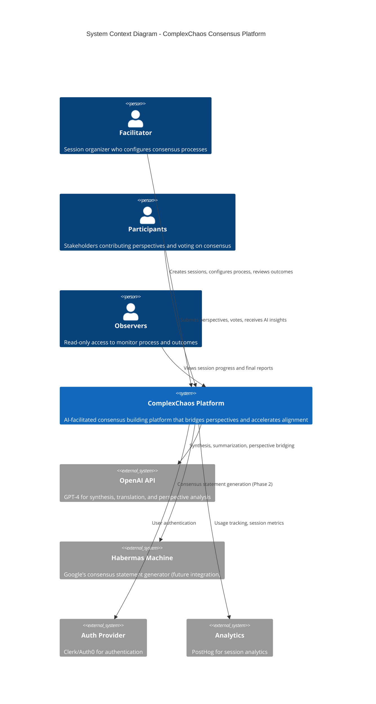
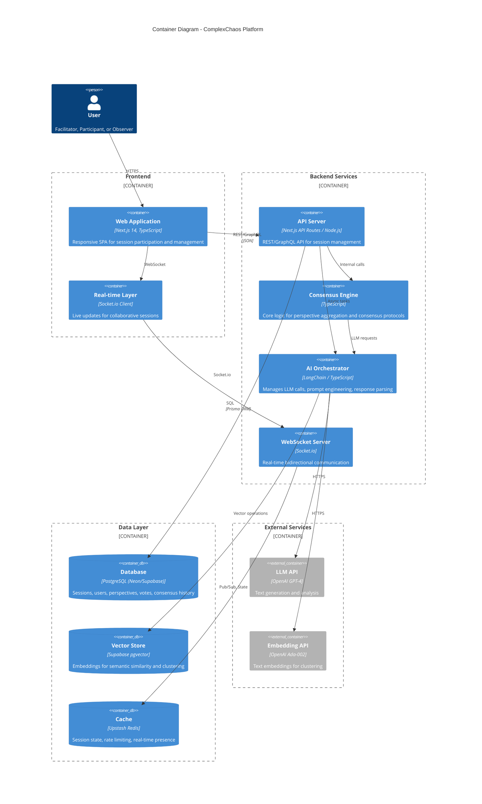
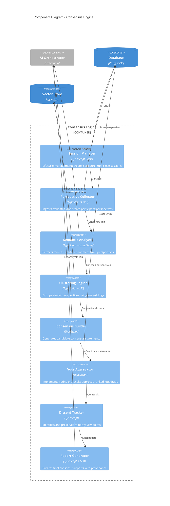
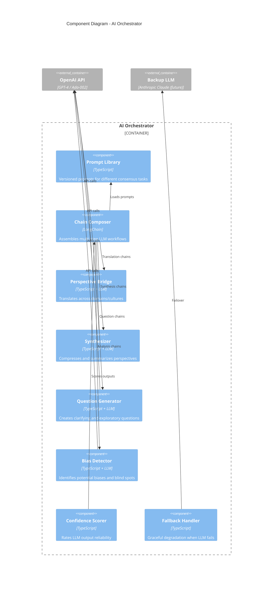
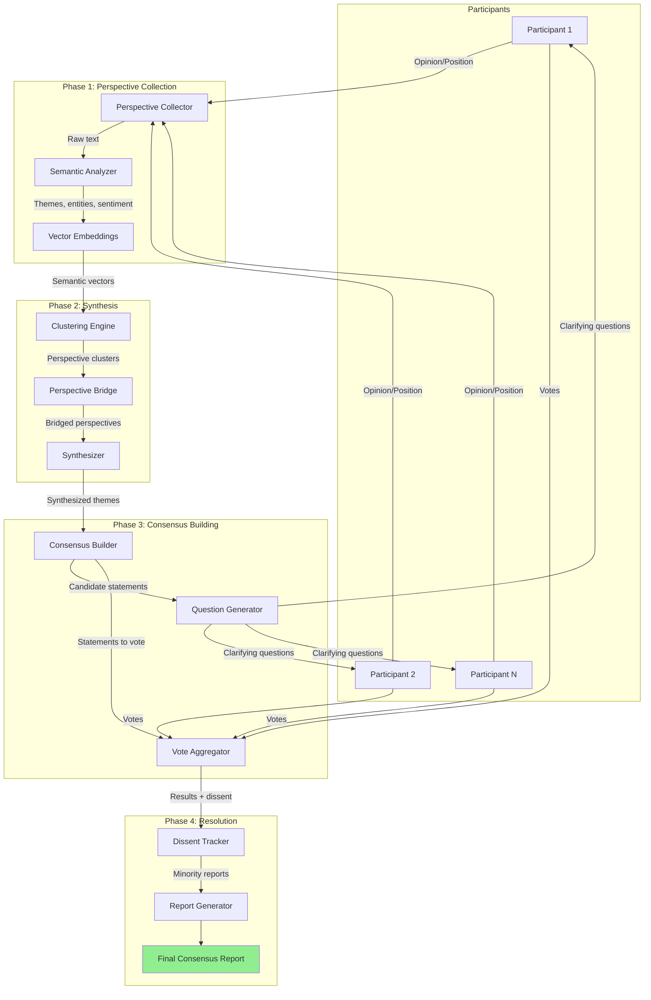
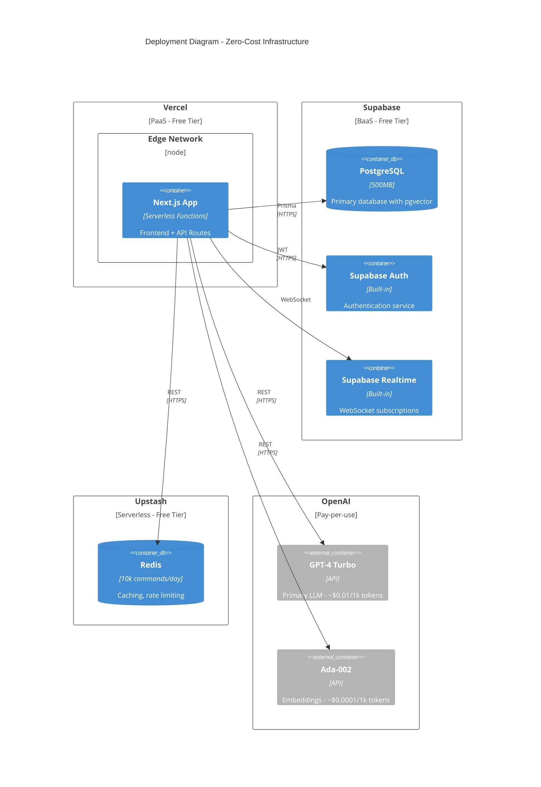
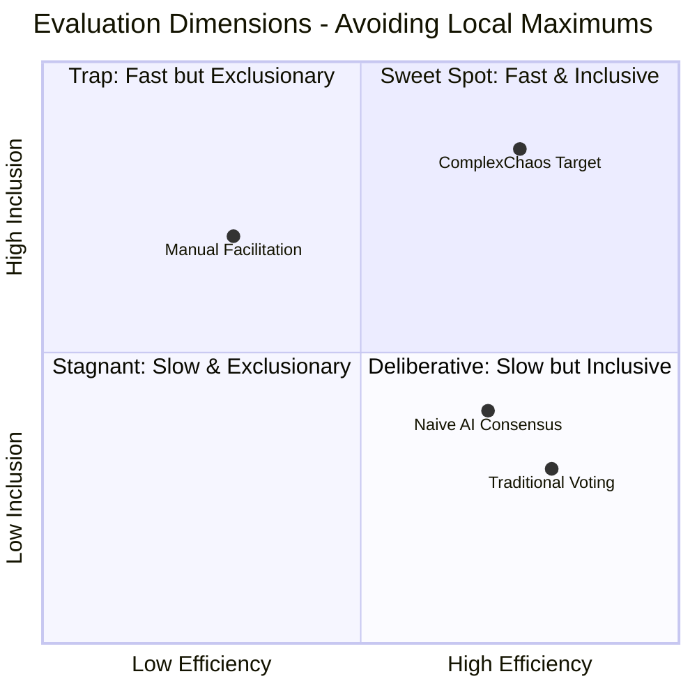
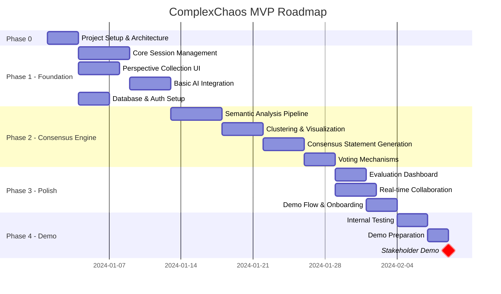

# ComplexChaos MVP/POC - C4 Architecture Documentation

## Executive Summary

**Vision**: "Google Translate for Human Cooperation" - An AI-facilitated platform that bridges cognitive, cultural, and professional gaps to help diverse stakeholders reach consensus faster and more inclusively.

**Core Problem**: Traditional collaboration tools (Slack, Google Docs) assume shared goals. ComplexChaos addresses **cooperation** - where participants have conflicting interests, different backgrounds, and need structured facilitation to find common ground.

**MVP Scope**: A lightweight, zero-cost proof-of-concept demonstrating AI-facilitated consensus building for small groups (5-15 participants) with measurable outcomes.

---

## Table of Contents

1. [Strategic Analysis & Vision](#1-strategic-analysis--vision)
2. [C4 Architecture Diagrams](#2-c4-architecture-diagrams)
3. [Technology Choices & Justifications](#3-technology-choices--justifications)
4. [Evaluation Framework](#4-evaluation-framework)
5. [Zero-Cost Hosting Strategy](#5-zero-cost-hosting-strategy)
6. [Roadmap](#6-roadmap)
7. [Risk Mitigation](#7-risk-mitigation)
8. [Demo Script](#8-demo-script)

---

## 1. Strategic Analysis & Vision

### 1.1 Problem Space Understanding

Based on the materials analyzed, ComplexChaos operates at the intersection of:

| Domain | Challenge | Our Approach |
|--------|-----------|--------------|
| **Diplomacy** | 100k+ pages, 120+ agenda items, bloc coordination delays | Real-time synthesis, structured consensus protocols |
| **Enterprise Strategy** | 3-month planning cycles, siloed negotiations | Async AI-facilitated alignment, perspective bridging |
| **Multi-stakeholder Governance** | Power imbalances, minority voice suppression | Inclusive aggregation, Habermas-inspired representation |

### 1.2 Key Differentiators

```
┌─────────────────────────────────────────────────────────────────────┐
│                    COLLABORATION vs COOPERATION                     │
├─────────────────────────────────────────────────────────────────────┤
│  COLLABORATION (Slack, Docs)       │  COOPERATION (ComplexChaos)    │
│  ─────────────────────────────────│────────────────────────────────│
│  • Assumes shared goals            │  • Assumes conflicting goals   │
│  • Passive tool                    │  • Active AI mediator          │
│  • Content creation focus          │  • Understanding & alignment   │
│  • Same vocabulary assumed         │  • Cross-domain translation    │
└─────────────────────────────────────────────────────────────────────┘
```

### 1.3 Critical Success Factors (Avoiding Local Maximums)

**The "Local Maximum Trap"** in AI-facilitated consensus:
- **Trap 1**: Optimizing for speed → Sacrificing minority representation
- **Trap 2**: Optimizing for agreement → Smoothing over legitimate disagreements
- **Trap 3**: Optimizing for AI accuracy → Losing human agency
- **Trap 4**: Optimizing for engagement → Creating filter bubbles

**Our Counter-Measures**:

| Trap | Mitigation Strategy | Metric |
|------|---------------------|--------|
| Speed over inclusion | Forced perspective exploration before consensus | % perspectives surfaced vs total |
| False consensus | Dissent tracking & explicit minority reports | Dissent visibility score |
| AI over-reliance | Human-in-the-loop checkpoints, confidence bounds | Human override rate |
| Echo chambers | Cross-pollination prompts, adversarial perspectives | Perspective diversity index |

---

## 2. C4 Architecture Diagrams

### 2.1 Level 1: System Context Diagram



### 2.2 Level 2: Container Diagram



### 2.3 Level 3: Component Diagram (Consensus Engine)



### 2.4 Level 3: Component Diagram (AI Orchestrator)



### 2.5 Data Flow Diagram



### 2.6 Deployment Diagram (Zero-Cost MVP)



---

## 3. Technology Choices & Justifications

### 3.1 Frontend Stack

| Technology | Choice | Justification |
|------------|--------|---------------|
| **Framework** | Next.js 14 (App Router) | Aligns with job req (Vue→Next.js migration); SSR for SEO; API routes eliminate separate backend |
| **Language** | TypeScript | Type safety for complex consensus logic; job requirement |
| **UI Library** | shadcn/ui + Tailwind | Zero-cost, accessible, professional appearance |
| **State Management** | Zustand + React Query | Lightweight, integrates with real-time subscriptions |
| **Real-time** | Supabase Realtime | Free tier, PostgreSQL native, eliminates separate WS server |

### 3.2 Backend Stack

| Technology | Choice | Justification |
|------------|--------|---------------|
| **Runtime** | Next.js API Routes (Serverless) | Zero hosting cost on Vercel; unified codebase |
| **ORM** | Prisma | Type-safe DB access; excellent migration tooling |
| **AI Orchestration** | Vercel AI SDK + LangChain.js | Native streaming; composable chains; Next.js optimized |
| **Background Jobs** | Vercel Cron + Inngest (free tier) | Long-running consensus tasks; event-driven |

### 3.3 Data Layer

| Technology | Choice | Justification |
|------------|--------|---------------|
| **Primary DB** | Supabase PostgreSQL | 500MB free; pgvector built-in; real-time subscriptions |
| **Vector Store** | pgvector (Supabase) | No separate vector DB cost; HNSW indexes |
| **Cache** | Upstash Redis | 10k req/day free; serverless; rate limiting |
| **File Storage** | Supabase Storage | 1GB free; integrated with auth |

### 3.4 AI/ML Services

| Technology | Choice | Justification |
|------------|--------|---------------|
| **Primary LLM** | GPT-4 Turbo (OpenAI) | Best reasoning for consensus synthesis; streaming support |
| **Embeddings** | text-embedding-ada-002 | Cost-effective; sufficient quality for clustering |
| **Backup LLM** | Claude 3 Haiku (future) | Fallback; different perspective for bias detection |

### 3.5 Decision Matrix

```
                    ┌─────────────────────────────────────────────────────────┐
                    │           TECHNOLOGY DECISION MATRIX                    │
                    ├─────────────┬──────────┬──────────┬──────────┬─────────┤
                    │ Criterion   │ Weight   │ Next.js  │ Vue+Node │ Django  │
                    ├─────────────┼──────────┼──────────┼──────────┼─────────┤
                    │ Free Tier   │   25%    │    10    │     7    │    6    │
                    │ Job Fit     │   25%    │    10    │     5    │    3    │
                    │ AI Integr.  │   20%    │     9    │     8    │    7    │
                    │ Real-time   │   15%    │     8    │     9    │    6    │
                    │ Dev Speed   │   15%    │     9    │     8    │    7    │
                    ├─────────────┼──────────┼──────────┼──────────┼─────────┤
                    │ TOTAL       │  100%    │   9.35   │   7.25   │   5.85  │
                    └─────────────┴──────────┴──────────┴──────────┴─────────┘
```

---

## 4. Evaluation Framework

### 4.1 Avoiding Local Maximums: The Trustworthy Consensus Scorecard

Traditional metrics (speed, user satisfaction) can optimize toward local maximums that harm long-term value. Our evaluation framework uses **multi-dimensional metrics with tension awareness**.



### 4.2 Core Evaluation Metrics

#### Tier 1: Process Quality Metrics

| Metric | Definition | Target | Anti-Gaming Measure |
|--------|------------|--------|---------------------|
| **Perspective Diversity Index (PDI)** | Semantic distance variance across submitted perspectives | >0.6 (0-1 scale) | Penalize if AI-generated perspectives detected |
| **Minority Voice Representation (MVR)** | % of final consensus that addresses minority concerns | >30% | Explicit dissent tracking in report |
| **Consensus Stability Score (CSS)** | Would participants re-affirm consensus after 24h? | >80% re-affirmation | Delayed follow-up survey |
| **Human Override Rate (HOR)** | Frequency of participants rejecting AI suggestions | 15-40% (healthy range) | Too low = over-reliance; too high = poor AI |

#### Tier 2: Outcome Quality Metrics

| Metric | Definition | Target | Measurement |
|--------|------------|--------|-------------|
| **Agreement Actionability** | Can consensus be converted to concrete actions? | >75% actionable items | Expert review + participant assessment |
| **Stakeholder Satisfaction Variance** | Std dev of satisfaction across participant types | <0.5 (low variance) | Post-session survey by role |
| **Predicted Implementation Rate** | Likelihood consensus will be implemented | >70% | 30-day follow-up |

#### Tier 3: Ethical Safeguards

| Metric | Definition | Red Flag Threshold |
|--------|------------|--------------------|
| **Power Imbalance Detection** | Correlation between participant "status" and influence on outcome | r > 0.7 |
| **Perspective Suppression Rate** | % of submitted perspectives not reflected in synthesis | >50% |
| **AI Hallucination Rate** | Consensus statements not grounded in actual submissions | >5% |

### 4.3 Evaluation Dashboard Wireframe

```
┌──────────────────────────────────────────────────────────────────────────────┐
│                    SESSION EVALUATION DASHBOARD                               │
├──────────────────────────────────────────────────────────────────────────────┤
│                                                                               │
│  ┌─────────────────────┐  ┌─────────────────────┐  ┌─────────────────────┐   │
│  │  PROCESS HEALTH     │  │  OUTCOME QUALITY    │  │  ETHICAL CHECKS     │   │
│  │  ────────────────   │  │  ────────────────   │  │  ────────────────   │   │
│  │  PDI:  ████████ 0.72│  │  Actionable: 78%    │  │  Power Balance: ✓   │   │
│  │  MVR:  ██████── 35% │  │  Satisfaction: 4.2  │  │  Suppression: ✓     │   │
│  │  CSS:  ████████ 85% │  │  Impl. Pred: 72%    │  │  Hallucination: ✓   │   │
│  │  HOR:  █████─── 28% │  │  Variance: 0.3      │  │  All checks passed  │   │
│  └─────────────────────┘  └─────────────────────┘  └─────────────────────┘   │
│                                                                               │
│  ┌───────────────────────────────────────────────────────────────────────┐   │
│  │  PERSPECTIVE COVERAGE MAP                                              │   │
│  │  ┌─────────────────────────────────────────────────────────────────┐  │   │
│  │  │         Cluster A (Economic)    ●●●●●                           │  │   │
│  │  │         Cluster B (Social)      ●●●        ← Minority cluster   │  │   │
│  │  │         Cluster C (Technical)   ●●●●●●●                         │  │   │
│  │  │         Cluster D (Political)   ●●●●                            │  │   │
│  │  │         [Unclustered]           ●●          ← Review needed     │  │   │
│  │  └─────────────────────────────────────────────────────────────────┘  │   │
│  └───────────────────────────────────────────────────────────────────────┘   │
│                                                                               │
│  ┌───────────────────────────────────────────────────────────────────────┐   │
│  │  DISSENT REGISTER (Preserved Minority Views)                          │   │
│  │  ─────────────────────────────────────────────────────────────────    │   │
│  │  1. "Budget concerns were not fully addressed" - 3 participants       │   │
│  │  2. "Timeline too aggressive" - 2 participants                        │   │
│  │  3. "Need more stakeholder input" - 1 participant                     │   │
│  └───────────────────────────────────────────────────────────────────────┘   │
│                                                                               │
└──────────────────────────────────────────────────────────────────────────────┘
```

### 4.4 A/B Testing Framework

To avoid local maximums, we run **multi-armed bandit tests** on:

1. **Prompt Variations**: Different synthesis prompts, measure PDI + CSS
2. **Voting Mechanisms**: Approval vs Ranked vs Quadratic, measure MVR + Satisfaction
3. **AI Intervention Timing**: Early vs Late AI suggestions, measure HOR + Outcome Quality

```typescript
// Evaluation Pipeline Pseudocode
interface SessionEvaluation {
  processMetrics: {
    perspectiveDiversityIndex: number;    // 0-1
    minorityVoiceRepresentation: number;  // 0-1
    consensusStabilityScore: number;      // 0-1
    humanOverrideRate: number;            // 0-1
  };
  outcomeMetrics: {
    agreementActionability: number;       // 0-1
    satisfactionVariance: number;         // lower is better
    implementationPrediction: number;     // 0-1
  };
  ethicalChecks: {
    powerImbalanceDetected: boolean;
    perspectiveSuppressionRate: number;
    aiHallucinationRate: number;
  };
  overallScore: number;                   // Weighted composite
}

function evaluateSession(session: Session): SessionEvaluation {
  // Multi-dimensional evaluation prevents gaming single metrics
  const weights = {
    processHealth: 0.35,
    outcomeQuality: 0.35,
    ethicalCompliance: 0.30  // High weight prevents corner-cutting
  };
  
  // Penalize sessions that score high on speed but low on inclusion
  const inclusionPenalty = calculateInclusionPenalty(session);
  
  return computeWeightedScore(session, weights, inclusionPenalty);
}
```

---

## 5. Zero-Cost Hosting Strategy

### 5.1 Infrastructure Cost Breakdown

| Service | Free Tier Limits | MVP Usage Estimate | Cost |
|---------|------------------|-------------------|------|
| **Vercel** | 100GB bandwidth, 100k function invocations | ~50GB, ~50k invocations | $0 |
| **Supabase** | 500MB DB, 1GB storage, 2GB bandwidth | ~100MB DB, 200MB storage | $0 |
| **Upstash Redis** | 10k commands/day | ~5k commands/day | $0 |
| **OpenAI** | Pay-per-use | ~$10-20/month for demo | ~$15 |
| **Domain** | N/A (use vercel.app) | complexchaos-demo.vercel.app | $0 |
| **Analytics** | PostHog free tier: 1M events | ~100k events | $0 |

**Total MVP Cost: ~$15/month** (OpenAI only, manageable for demo)

### 5.2 Cost Optimization Strategies

```typescript
// 1. Aggressive Caching
const CACHE_CONFIG = {
  embeddingCache: '7d',      // Embeddings are deterministic
  synthesisCache: '1h',      // Re-use synthesis for same inputs
  sessionStateCache: '5m',   // Real-time updates
};

// 2. Batched LLM Calls
async function batchPerspectiveAnalysis(perspectives: string[]) {
  // Combine multiple perspectives into single prompt
  const batchPrompt = createBatchAnalysisPrompt(perspectives);
  return await openai.chat.completions.create({
    model: 'gpt-4-turbo',
    messages: [{ role: 'user', content: batchPrompt }],
  });
}

// 3. Tiered Model Usage
const MODEL_TIERS = {
  simple: 'gpt-3.5-turbo',     // Quick responses, low cost
  standard: 'gpt-4-turbo',     // Main synthesis work
  critical: 'gpt-4',           // Final consensus generation
};
```

### 5.3 Scaling Path (Post-MVP)

```
┌─────────────────────────────────────────────────────────────────────┐
│                    SCALING TIERS                                     │
├─────────────────────────────────────────────────────────────────────┤
│                                                                      │
│  TIER 0: MVP (Current)          TIER 1: Early Adopters              │
│  ─────────────────────          ────────────────────────            │
│  • 10 sessions/day              • 100 sessions/day                  │
│  • 5-15 participants            • 5-50 participants                 │
│  • ~$15/mo (OpenAI)             • ~$100/mo                          │
│  • Vercel Free                  • Vercel Pro ($20/mo)               │
│  • Supabase Free                • Supabase Pro ($25/mo)             │
│                                                                      │
│  TIER 2: Growth                 TIER 3: Enterprise                  │
│  ─────────────────              ────────────────────                │
│  • 1000 sessions/day            • Unlimited                         │
│  • 50-200 participants          • 200+ participants                 │
│  • ~$500/mo                     • Custom pricing                    │
│  • Vercel Enterprise            • Self-hosted option                │
│  • Supabase Team                • Dedicated infrastructure          │
│  • Fine-tuned models            • On-prem LLM option                │
│                                                                      │
└─────────────────────────────────────────────────────────────────────┘
```

---

## 6. Roadmap

### 6.1 Phase Overview



### 6.2 Detailed Phase Breakdown

#### Phase 0: Foundation (Days 1-3)
- [ ] Initialize Next.js 14 project with TypeScript
- [ ] Configure Supabase (DB + Auth + Realtime)
- [ ] Set up Prisma schema
- [ ] Configure Vercel deployment
- [ ] Establish CI/CD pipeline

#### Phase 1: Core Platform (Days 4-14)
- [ ] User authentication flow (Supabase Auth)
- [ ] Session CRUD operations
- [ ] Perspective submission interface
- [ ] Basic real-time presence
- [ ] OpenAI integration scaffold

#### Phase 2: Consensus Engine (Days 15-28)
- [ ] Embedding generation pipeline
- [ ] Perspective clustering (k-means on embeddings)
- [ ] AI synthesis prompts (perspective bridging)
- [ ] Consensus statement generator
- [ ] Multi-voting protocol implementation
- [ ] Dissent tracking system

#### Phase 3: Evaluation & Polish (Days 29-38)
- [ ] Evaluation metrics computation
- [ ] Dashboard visualization
- [ ] Session export/reporting
- [ ] Onboarding flow for demo
- [ ] Performance optimization

#### Phase 4: Demo Preparation (Days 39-42)
- [ ] End-to-end demo scenario
- [ ] Backup/fallback plans
- [ ] Presenter documentation
- [ ] Live environment validation

### 6.3 Success Criteria per Phase

| Phase | Must Have | Nice to Have | Success Metric |
|-------|-----------|--------------|----------------|
| **0** | Project scaffolded, deploys to Vercel | Automated tests | Green CI build |
| **1** | Create/join session, submit perspective | Real-time presence | 3 test users complete flow |
| **2** | AI generates synthesis, voting works | Cluster visualization | PDI > 0.5 in test session |
| **3** | Evaluation dashboard renders | Export to PDF | All Tier 1 metrics computed |
| **4** | 15-min demo without errors | Wow factor moments | Stakeholder approval |

---

## 7. Risk Mitigation

### 7.1 Technical Risks

| Risk | Likelihood | Impact | Mitigation |
|------|------------|--------|------------|
| OpenAI rate limits | Medium | High | Implement aggressive caching; have GPT-3.5 fallback |
| Supabase free tier exceeded | Low | Medium | Monitor usage; have upgrade path ready |
| Real-time sync issues | Medium | Medium | Implement optimistic UI; polling fallback |
| AI hallucinations in consensus | Medium | High | Human-in-the-loop approval; confidence thresholds |
| Poor embedding quality | Low | Medium | Pre-test with real perspectives; tune prompts |

### 7.2 Product Risks

| Risk | Likelihood | Impact | Mitigation |
|------|------------|--------|------------|
| Users don't understand value prop | Medium | High | Clear onboarding; demo scenario script |
| AI suggestions feel "artificial" | Medium | Medium | Tune prompts for natural language; show provenance |
| Minority voices ignored | Medium | High | Explicit dissent tracking; minority report feature |
| Demo environment fails | Low | Critical | Pre-record backup; local fallback |

### 7.3 Contingency Plans

```
┌─────────────────────────────────────────────────────────────────────┐
│                    DEMO DAY CONTINGENCIES                            │
├─────────────────────────────────────────────────────────────────────┤
│                                                                      │
│  SCENARIO 1: OpenAI API Down                                         │
│  ─────────────────────────────                                       │
│  • Switch to cached responses for demo scenario                      │
│  • Show pre-recorded video of AI features                            │
│  • Emphasize architecture, show AI working in dev environment        │
│                                                                      │
│  SCENARIO 2: Vercel Deployment Issues                                │
│  ─────────────────────────────────────                               │
│  • Run locally with ngrok tunnel                                     │
│  • Use pre-deployed backup on Railway.app                            │
│                                                                      │
│  SCENARIO 3: Database Connection Fails                               │
│  ─────────────────────────────────────                               │
│  • Switch to SQLite local mode                                       │
│  • Use seeded demo data                                              │
│                                                                      │
│  SCENARIO 4: Real-time Features Lag                                  │
│  ─────────────────────────────────                                   │
│  • Fall back to polling (5s interval)                                │
│  • Demonstrate with single-user flow                                 │
│                                                                      │
└─────────────────────────────────────────────────────────────────────┘
```

---

## 8. Demo Script

### 8.1 Demo Scenario: "Strategic Planning Consensus"

**Setup**: 5 department heads need to align on Q1 priorities

**Duration**: 15 minutes

### Act 1: The Problem (2 min)
```
NARRATOR: "Five department heads. Five different priorities. 
           Three months of back-and-forth emails. Sound familiar?"

[Show: Slack chaos, conflicting spreadsheets, frustrated faces]

NARRATOR: "What if AI could help them find common ground in 30 minutes?"
```

### Act 2: Perspective Collection (4 min)
```
[LIVE DEMO]
1. Create session: "Q1 Priority Alignment"
2. Share join link with audience (or use simulated participants)
3. Each "participant" submits their priority:
   - Marketing: "Brand awareness campaign - critical for growth"
   - Engineering: "Technical debt reduction - system stability at risk"
   - Sales: "CRM upgrade - losing deals due to poor tracking"
   - Finance: "Cost reduction - margins under pressure"
   - HR: "Culture initiative - retention dropping"

[Show: Perspectives appearing in real-time]
```

### Act 3: AI Synthesis (4 min)
```
[LIVE DEMO]
1. Click "Analyze Perspectives"
2. Show clustering visualization:
   - Cluster A: Growth-focused (Marketing, Sales)
   - Cluster B: Stability-focused (Engineering, Finance)
   - Cluster C: People-focused (HR)

3. AI generates perspective bridges:
   "Marketing's brand campaign CONNECTS to Sales' CRM needs 
    through improved lead tracking..."

4. Generate consensus candidates:
   - "Prioritize CRM upgrade with brand tracking integration"
   - "Phase technical debt work into CRM migration"
   - "Include culture component in cross-team collaboration"
```

### Act 4: Voting & Consensus (3 min)
```
[LIVE DEMO]
1. Participants vote (approval voting)
2. Show results with minority perspectives preserved
3. Generate final consensus report:
   
   "CONSENSUS: Integrated CRM + Brand Platform
    - Primary: CRM upgrade with marketing integration
    - Secondary: Technical debt addressed via migration
    - Commitment: Monthly culture touchpoints
    
    DISSENT NOTED:
    - Finance concerns about budget (addressed via phased approach)
    - HR wanted more emphasis on retention metrics"
```

### Act 5: The Metrics (2 min)
```
[Show Evaluation Dashboard]
- Perspective Diversity Index: 0.78 (high - good coverage)
- Minority Voice Representation: 40% (HR + Finance concerns included)
- Consensus Stability: 85% (likely to hold)
- Time Saved: ~85% vs traditional process
```

### 8.2 Key Talking Points for Presenter

1. **"Not just collaboration - cooperation"**
   - Slack helps people work together. We help people who *disagree* find common ground.

2. **"AI as translator, not decider"**
   - The AI doesn't pick winners. It helps people understand each other.

3. **"Minority voices matter"**
   - We explicitly track dissent. Consensus without inclusion isn't real consensus.

4. **"Measurable outcomes"**
   - 60% time reduction in Bonn climate negotiations
   - 91% discovered new perspectives
   - These aren't vanity metrics - they're process quality metrics

5. **"Enterprise ready"**
   - Same tech that helps diplomats can help your annual planning process

### 8.3 Anticipated Questions & Answers

| Question | Answer |
|----------|--------|
| "How is this different from a survey?" | Surveys collect opinions. We synthesize understanding and build bridges between perspectives. |
| "What if people game the system?" | Our multi-dimensional evaluation catches gaming. High agreement with low diversity triggers review. |
| "Does this work for contentious topics?" | Yes - that's our sweet spot. We don't smooth over disagreement; we make it productive. |
| "What about data privacy?" | All data in your control. Self-hosting option for sensitive contexts. |
| "Can it handle 100+ participants?" | MVP handles 15. Architecture scales to thousands (see Tier 3 roadmap). |

---

## Appendix A: Database Schema

```prisma
// prisma/schema.prisma

model User {
  id            String    @id @default(cuid())
  email         String    @unique
  name          String?
  role          UserRole  @default(PARTICIPANT)
  sessions      SessionParticipant[]
  perspectives  Perspective[]
  votes         Vote[]
  createdAt     DateTime  @default(now())
  updatedAt     DateTime  @updatedAt
}

enum UserRole {
  ADMIN
  FACILITATOR
  PARTICIPANT
  OBSERVER
}

model Session {
  id              String    @id @default(cuid())
  title           String
  description     String?
  status          SessionStatus @default(DRAFT)
  config          Json      // Voting method, time limits, etc.
  createdBy       String
  participants    SessionParticipant[]
  perspectives    Perspective[]
  clusters        Cluster[]
  consensusItems  ConsensusItem[]
  evaluation      SessionEvaluation?
  createdAt       DateTime  @default(now())
  updatedAt       DateTime  @updatedAt
}

enum SessionStatus {
  DRAFT
  COLLECTING
  ANALYZING
  VOTING
  COMPLETED
  ARCHIVED
}

model SessionParticipant {
  id        String   @id @default(cuid())
  session   Session  @relation(fields: [sessionId], references: [id])
  sessionId String
  user      User     @relation(fields: [userId], references: [id])
  userId    String
  role      ParticipantRole @default(CONTRIBUTOR)
  joinedAt  DateTime @default(now())
  
  @@unique([sessionId, userId])
}

enum ParticipantRole {
  FACILITATOR
  CONTRIBUTOR
  OBSERVER
}

model Perspective {
  id          String    @id @default(cuid())
  session     Session   @relation(fields: [sessionId], references: [id])
  sessionId   String
  author      User      @relation(fields: [authorId], references: [id])
  authorId    String
  content     String
  embedding   Float[]   // pgvector
  themes      String[]
  sentiment   Float?
  cluster     Cluster?  @relation(fields: [clusterId], references: [id])
  clusterId   String?
  createdAt   DateTime  @default(now())
}

model Cluster {
  id            String        @id @default(cuid())
  session       Session       @relation(fields: [sessionId], references: [id])
  sessionId     String
  label         String
  summary       String?
  centroid      Float[]       // pgvector
  perspectives  Perspective[]
  createdAt     DateTime      @default(now())
}

model ConsensusItem {
  id          String    @id @default(cuid())
  session     Session   @relation(fields: [sessionId], references: [id])
  sessionId   String
  statement   String
  rationale   String?
  sources     String[]  // Perspective IDs that contributed
  votes       Vote[]
  status      ConsensusStatus @default(CANDIDATE)
  finalScore  Float?
  createdAt   DateTime  @default(now())
}

enum ConsensusStatus {
  CANDIDATE
  APPROVED
  REJECTED
  MINORITY_REPORT
}

model Vote {
  id              String        @id @default(cuid())
  consensusItem   ConsensusItem @relation(fields: [consensusItemId], references: [id])
  consensusItemId String
  voter           User          @relation(fields: [voterId], references: [id])
  voterId         String
  value           Int           // -1 (disagree), 0 (neutral), 1 (agree), or rank
  comment         String?
  createdAt       DateTime      @default(now())
  
  @@unique([consensusItemId, voterId])
}

model SessionEvaluation {
  id                        String   @id @default(cuid())
  session                   Session  @relation(fields: [sessionId], references: [id])
  sessionId                 String   @unique
  perspectiveDiversityIndex Float
  minorityVoiceRep          Float
  consensusStabilityScore   Float
  humanOverrideRate         Float
  actionabilityScore        Float
  satisfactionVariance      Float
  implementationPrediction  Float
  ethicalFlags              String[]
  computedAt                DateTime @default(now())
}
```

---

## Appendix B: Key API Endpoints

```typescript
// API Route Structure (Next.js App Router)

// Sessions
POST   /api/sessions                    // Create session
GET    /api/sessions                    // List user's sessions
GET    /api/sessions/[id]               // Get session details
PATCH  /api/sessions/[id]               // Update session config
POST   /api/sessions/[id]/join          // Join session
POST   /api/sessions/[id]/start         // Begin collection phase
POST   /api/sessions/[id]/analyze       // Trigger AI analysis
POST   /api/sessions/[id]/vote          // Start voting phase
POST   /api/sessions/[id]/complete      // Finalize session

// Perspectives
POST   /api/sessions/[id]/perspectives  // Submit perspective
GET    /api/sessions/[id]/perspectives  // List perspectives
GET    /api/sessions/[id]/clusters      // Get clustered perspectives

// Consensus
GET    /api/sessions/[id]/consensus     // Get consensus items
POST   /api/sessions/[id]/consensus/[itemId]/vote  // Vote on item

// AI Operations
POST   /api/ai/synthesize               // Generate synthesis
POST   /api/ai/bridge                   // Generate perspective bridge
POST   /api/ai/questions                // Generate clarifying questions

// Evaluation
GET    /api/sessions/[id]/evaluation    // Get session evaluation
POST   /api/sessions/[id]/evaluation/compute  // Trigger evaluation
```

---

## Appendix C: Environment Variables

```env
# .env.local

# Supabase
NEXT_PUBLIC_SUPABASE_URL=https://xxx.supabase.co
NEXT_PUBLIC_SUPABASE_ANON_KEY=xxx
SUPABASE_SERVICE_ROLE_KEY=xxx

# OpenAI
OPENAI_API_KEY=sk-xxx

# Upstash Redis
UPSTASH_REDIS_REST_URL=https://xxx.upstash.io
UPSTASH_REDIS_REST_TOKEN=xxx

# App Config
NEXT_PUBLIC_APP_URL=https://complexchaos-demo.vercel.app
NODE_ENV=development

# Analytics (Optional)
NEXT_PUBLIC_POSTHOG_KEY=xxx
NEXT_PUBLIC_POSTHOG_HOST=https://app.posthog.com
```

---

## Appendix D: Mermaid Diagram Render Instructions

All diagrams in this document use Mermaid syntax. To render:

1. **VS Code**: Install "Markdown Preview Mermaid Support" extension
2. **GitHub**: Renders natively in `.md` files
3. **Online**: Use [mermaid.live](https://mermaid.live)
4. **Export**: Use Mermaid CLI: `mmdc -i input.md -o output.png`

---

*Document Version: 1.0*
*Last Updated: 2024-01-XX*
*Author: Architecture Team*
