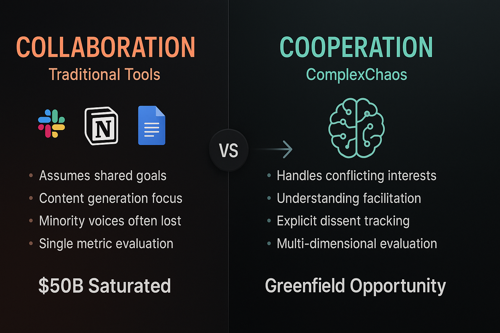
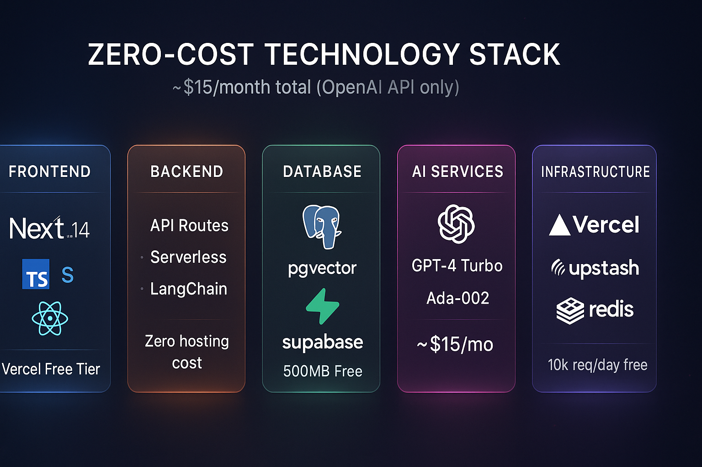

# ComplexChaos: Architecture Review

> **What I learned, what excites me, and where I'd focus.**

---

## First Impressions

I'm genuinely grateful for the opportunity to learn about ComplexChaos. After studying the materials, watching the demos, and reading the coverage — I found myself increasingly excited about what you're building. This is the kind of company I want to grow with.

But I also want to be direct about what I see — both the strengths and the areas where I'd want us to focus energy together.

---

## What Stands Out

**The mission is rare.** Most AI startups optimize individual productivity. ComplexChaos tackles *collective intelligence* — helping groups with conflicting interests find common ground. That's underserved and meaningful.

**The validation is real.** Bonn wasn't a demo — it was deployment with actual diplomats at a UN facility:

| Metric | Result |
|--------|--------|
| **60%** | Time reduction in coordination |
| **91%** | Discovered new perspectives |
| **35%** | Empathy increase |
| **3x** | Co-presence improvement |

**The backing is serious.** Reid Hoffman's VC, Gates/Bezos/Zuckerberg funding, WhatsApp and Google Assistant co-founders as angels. This isn't a garage project.

---

## Where I'd Focus

### 1. Evaluation Depth

The Bonn metrics are strong for a pilot. But for enterprise and long-term credibility:

- **Do consensus decisions hold after 30 days?**
- **Are minority concerns addressed or just noted?**
- **What's the implementation success rate vs. traditional processes?**

This isn't criticism — it's opportunity. Building this together could become a real differentiator.

### 2. Domain Prioritization

The vision spans climate, enterprise, public health, governance. Each has different:
- User personas
- Workflows  
- Success metrics
- Go-to-market

**My question**: Who's the primary user today? Going deep in one domain before expanding typically wins.

### 3. Trust Architecture

AI-facilitated consensus carries real responsibility:

| Risk | Mitigation Needed |
|------|-------------------|
| AI agenda-setting | Transparent reasoning |
| Minority suppression | Explicit dissent tracking |
| Over-reliance | Human override mechanisms |
| Accountability gaps | Full audit trail |

The "dissent tracking" mentioned in materials is a good start. I'd be eager to help evolve this into a core product differentiator.

---

## What I'd Contribute

| Area | Contribution |
|------|--------------|
| **Evaluation Framework** | Automated metrics, longitudinal tracking, regression detection |
| **RAG Pipelines** | Handle 100k+ page contexts for negotiations |
| **Trust Features** | "Show AI reasoning", challenge tools, audit trails |
| **Vue → Next.js Migration** | Direct alignment with job description |
| **Observability** | LLM tracing, debugging "why did AI say that?" |

---

## Proposed MVP Architecture

For a zero-cost proof-of-concept (~$15/month):

| Layer | Choice | Why |
|-------|--------|-----|
| **Frontend** | Next.js 14 | Job alignment, Vercel free tier |
| **Database** | Supabase PostgreSQL + pgvector | 500MB free, embeddings built-in |
| **AI** | OpenAI GPT-4 Turbo | Best reasoning for synthesis |
| **Real-time** | Supabase Realtime | No separate WebSocket cost |

---

## Bottom Line

**What excites me**: A rare mission with real validation and serious backing — and a team I'd be proud to join.

**Where I see us focusing**: Evaluation depth, domain prioritization, trust architecture.

**What I'm eager to build**: Metrics infrastructure, transparency features, RAG optimization.

**Question I'd love to explore together**: How do we help users trust AI enough to benefit, but stay skeptical enough to catch errors?

I'm not looking for just a job — I'm looking for a mission worth committing to. ComplexChaos feels like that.

---

**[Full C4 Documentation](./ARCHITECTURE.md)** · **[Presenter Guide](./PRESENTER_GUIDE.md)** · **[About Me](./ABOUT_ME.md)**

