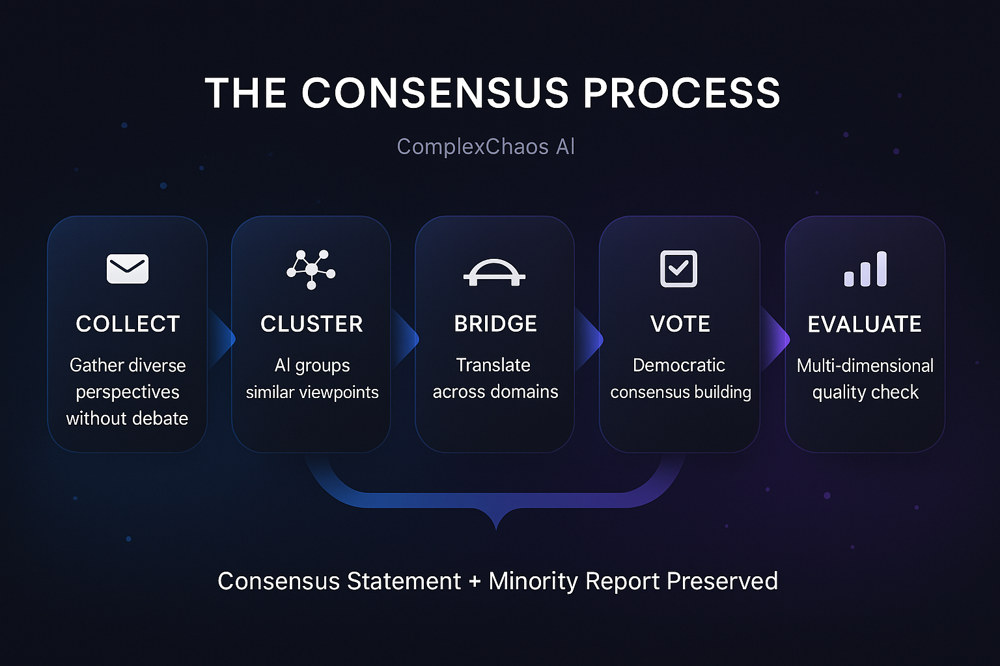

# ComplexChaos MVP/POC

> **"Google Translate for Human Cooperation"**

AI-facilitated consensus building platform that bridges perspectives and accelerates alignment for groups with conflicting interests.

<div align="center">

📖 [**Architecture Docs**](./ARCHITECTURE.md) · 🎯 [**Presenter Guide**](./PRESENTER_GUIDE.md) · 📊 [**Diagrams**](./diagrams/)

</div>

---

## The Problem

Traditional collaboration tools assume everyone has the same goal. But real-world decisions involve **conflicting priorities**, **different backgrounds**, **power imbalances**, and **information overload** (100k+ pages in climate negotiations alone).

---

## Our Solution: The Consensus Process

<div align="center">

</div>

> **Key Insight**: AI doesn't decide who wins — it helps everyone understand *why* others think differently.

---

## Proven Results: Bonn Climate Pilot

<div align="center">

</div>

*Tested with delegates from 9 African nations representing 178 million people at the UNFCCC campus*

---

## Architecture at a Glance

<div align="center">

</div>

**Monthly Cost: ~$15** (OpenAI API only; all infrastructure on free tiers)

---

## Key Differentiators: Collaboration vs Cooperation

<div align="center">

</div>

---

## Avoiding "Local Maximum" Traps

> ⚠️ **The Risk**: Optimizing single metrics leads to solutions that look good but aren't actually good.

<div align="center">

</div>

---

## Technology Stack

<div align="center">

</div>

---

## Repository Structure

```
📁 webapp/
├── 📄 README.md              ← You are here
├── 📄 ARCHITECTURE.md        ← Full C4 documentation
├── 📄 PRESENTER_GUIDE.md     ← Demo quick reference
├── 📁 assets/infographics/   ← Visual infographics
└── 📁 diagrams/              ← Mermaid source files
    ├── c4-context.mmd
    ├── c4-container.mmd
    ├── consensus-flow.mmd
    ├── deployment.mmd
    ├── evaluation-metrics.mmd
    └── roadmap.mmd
```

---

## Roadmap Summary

| Phase | Duration | Focus |
|:-----:|:--------:|-------|
| **0** | Days 1-3 | 🏗️ Project setup, infrastructure |
| **1** | Days 4-14 | 🔧 Core: sessions, auth, perspectives |
| **2** | Days 15-28 | 🤖 AI: clustering, synthesis, voting |
| **3** | Days 29-38 | ✨ Evaluation dashboard, polish |
| **4** | Days 39-42 | 🚀 Demo preparation |

---

## Getting Started

```bash
# Clone repository
git clone <repo-url>
cd complexchaos-mvp

# Install dependencies
npm install

# Set up environment
cp .env.example .env.local
# Add your API keys

# Run development server
npm run dev

# Open http://localhost:3000
```

---

<div align="center">

## Contributing

This is an MVP/POC. See [ARCHITECTURE.md](./ARCHITECTURE.md) for technical details.

---

**License**: Proprietary - ComplexChaos Inc.

---

*Built with the belief that AI can help humans understand each other better, not just faster.*

</div>
