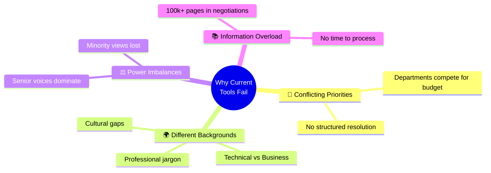
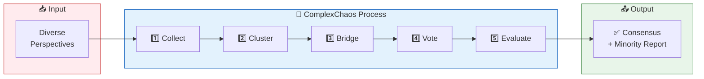
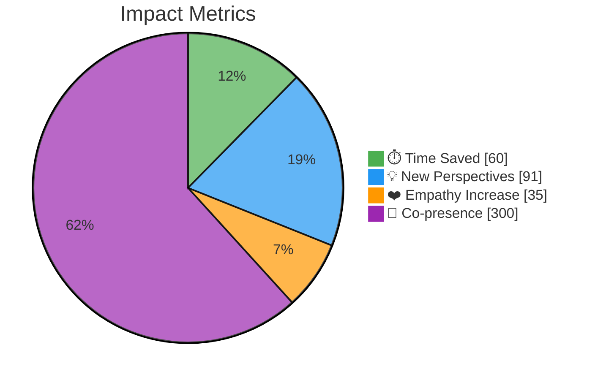
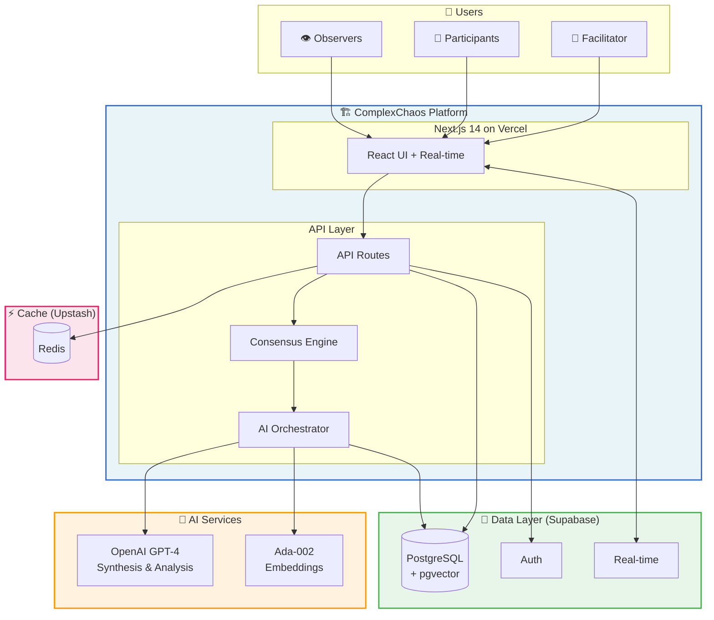
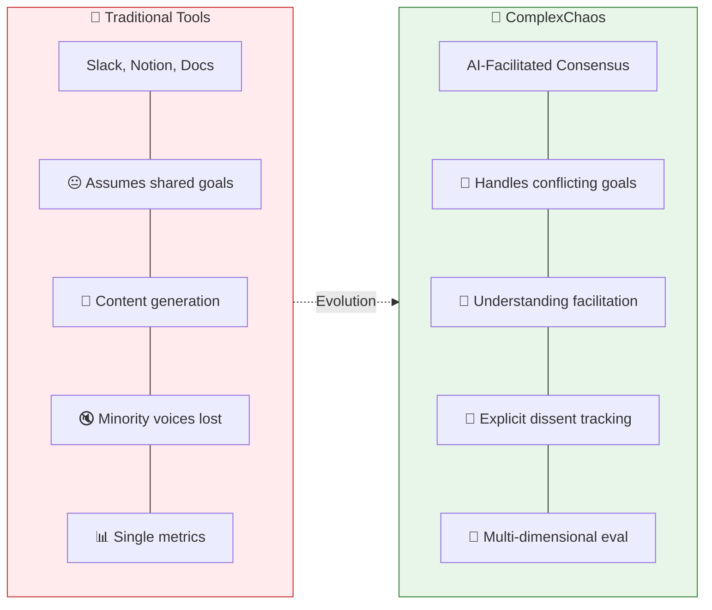
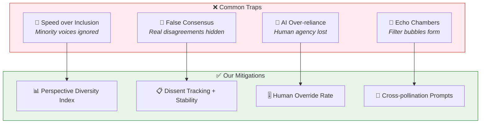
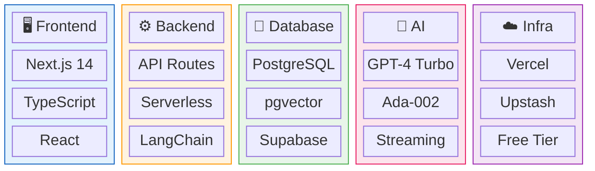
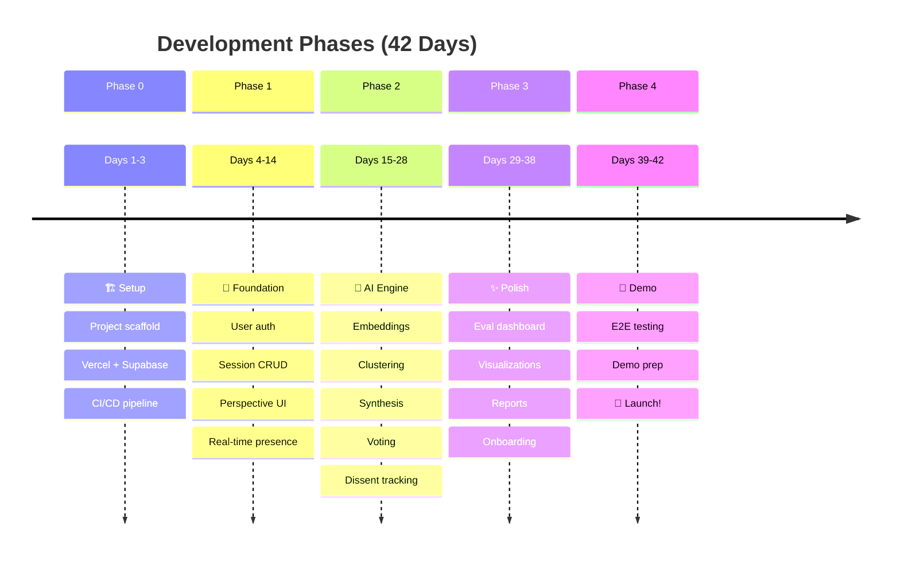

# ComplexChaos MVP/POC

> **"Google Translate for Human Cooperation"**

AI-facilitated consensus building platform that bridges perspectives and accelerates alignment for groups with conflicting interests.

<div align="center">

📖 [**Architecture Docs**](./ARCHITECTURE.md) · 🎯 [**Presenter Guide**](./PRESENTER_GUIDE.md) · 📊 [**Diagrams**](./diagrams/)

</div>

---

## The Problem



---

## Our Solution



> **Key Insight**: AI doesn't decide who wins — it helps everyone understand *why* others think differently.

---

## Key Results (Bonn Climate Pilot)

<div align="center">



</div>

| Metric | Result | What It Means |
|:------:|:------:|---------------|
| ⏱️ | **60%** faster | Coordination time slashed |
| 💡 | **91%** discovered | Perspectives they would've missed |
| ❤️ | **35%** increase | Perceived empathy between delegates |
| 👥 | **3x** stronger | Co-presence even during solo work |

> 🌍 *Tested with delegates from 9 African nations representing 178 million people*

---

## Architecture at a Glance



<div align="center">

**💰 Monthly Cost: ~$15** *(OpenAI API only — all infrastructure on free tiers)*

</div>

---

## Key Differentiators



<div align="center">

| | **Collaboration** | **Cooperation** |
|:---:|:---:|:---:|
| **Market** | $50B (Saturated) | 🆕 Greenfield |
| **Players** | Slack, Notion, Miro | **ComplexChaos** |

</div>

---

## Avoiding "Local Maximum" Traps

> ⚠️ **The Risk**: Optimizing single metrics leads to solutions that look good but aren't actually good.



---

## Technology Stack



<div align="center">

| 🏷️ | Tech | Why |
|:---:|:---|:---|
| 🖥️ | **Next.js 14** | Job alignment + Vercel free tier |
| 💾 | **Supabase** | 500MB free + pgvector + real-time |
| 🤖 | **GPT-4 Turbo** | Best reasoning + streaming |
| ⚡ | **Upstash Redis** | 10k req/day free |

</div>

---

## Roadmap



---

## Repository Structure

```
📁 webapp/
├── 📄 README.md              ← You are here
├── 📄 ARCHITECTURE.md        ← Full C4 documentation
├── 📄 PRESENTER_GUIDE.md     ← Demo quick reference
└── 📁 diagrams/              ← Mermaid source files
    ├── c4-context.mmd
    ├── c4-container.mmd
    ├── consensus-flow.mmd
    ├── deployment.mmd
    ├── evaluation-metrics.mmd
    └── roadmap.mmd
```

---

## Getting Started

```bash
# Clone repository
git clone <repo-url>
cd complexchaos-mvp

# Install dependencies
npm install

# Set up environment
cp .env.example .env.local
# Add your API keys

# Run development server
npm run dev

# Open http://localhost:3000
```

---

<div align="center">

## Contributing

This is an MVP/POC. See [ARCHITECTURE.md](./ARCHITECTURE.md) for technical details.

---

**License**: Proprietary - ComplexChaos Inc.

---

*Built with the belief that AI can help humans understand each other better, not just faster.* 

🌐 **[complexchaos.ai](https://complexchaos.ai)**

</div>
