# ComplexChaos MVP/POC

> **"Google Translate for Human Cooperation"**

AI-facilitated consensus building platform that bridges perspectives and accelerates alignment for groups with conflicting interests.

## Quick Links

| Document | Purpose |
|----------|---------|
| [ARCHITECTURE.md](./ARCHITECTURE.md) | Complete C4 architecture, tech choices, evaluation framework |
| [PRESENTER_GUIDE.md](./PRESENTER_GUIDE.md) | Quick reference for demo presenters |
| [diagrams/](./diagrams/) | Mermaid source files for all diagrams |

## The Problem

Traditional collaboration tools assume everyone has the same goal. But real-world decisions involve:
- **Conflicting priorities** (departments competing for budget)
- **Different backgrounds** (technical vs business perspectives)
- **Power imbalances** (senior voices dominating)
- **Information overload** (100k+ pages in climate negotiations)

## Our Solution

ComplexChaos uses AI not to decide outcomes, but to **facilitate understanding**:

1. **Collect perspectives** without immediate debate
2. **Cluster and synthesize** to surface themes
3. **Bridge viewpoints** so people understand *why* others think differently
4. **Build consensus** with explicit dissent tracking
5. **Evaluate quality** to prevent "false consensus"

## Key Results (Bonn Pilot)

- **60%** reduction in coordination time
- **91%** discovered perspectives they would have missed
- **35%** increase in perceived empathy
- **3x** improvement in co-presence during solo work

## Architecture at a Glance

```mermaid
flowchart TB
    subgraph Users["👥 Users"]
        F["🎯 Facilitator"]
        P["👤 Participants"]
        O["👁️ Observers"]
    end

    subgraph Platform["🏗️ ComplexChaos Platform"]
        subgraph Frontend["Next.js 14 on Vercel"]
            UI["React UI + Real-time"]
        end
        
        subgraph Backend["API Layer"]
            API["API Routes"]
            CE["Consensus Engine"]
            AI["AI Orchestrator"]
        end
    end

    subgraph Data["💾 Data Layer (Supabase)"]
        DB[("PostgreSQL\n+ pgvector")]
        Auth["Auth"]
        RT["Real-time"]
    end

    subgraph External["🤖 AI Services"]
        GPT["OpenAI GPT-4\nSynthesis & Analysis"]
        EMB["Ada-002\nEmbeddings"]
    end

    subgraph Cache["⚡ Cache (Upstash)"]
        Redis[("Redis")]
    end

    F & P & O --> UI
    UI --> API
    UI <--> RT
    API --> CE
    CE --> AI
    API --> Auth
    API --> DB
    AI --> GPT & EMB
    AI --> DB
    API --> Redis

    style Platform fill:#e8f4f8,stroke:#326ce5,stroke-width:2px
    style Data fill:#e8f5e9,stroke:#4caf50,stroke-width:2px
    style External fill:#fff3e0,stroke:#ff9800,stroke-width:2px
    style Cache fill:#fce4ec,stroke:#e91e63,stroke-width:2px
```



**Monthly Cost: ~$15** (OpenAI API only; all infrastructure on free tiers)

## Key Differentiators

| Aspect | Traditional Tools | ComplexChaos |
|--------|-------------------|--------------|
| **Purpose** | Collaboration (shared goals) | Cooperation (conflicting goals) |
| **AI Role** | Content generation | Understanding facilitation |
| **Minority Voices** | Often lost | Explicitly tracked |
| **Evaluation** | Single metrics | Multi-dimensional (prevents gaming) |

## Avoiding "Local Maximum" Traps

We prevent optimization pitfalls with multi-dimensional evaluation:

| Trap | Risk | Our Mitigation |
|------|------|----------------|
| Speed over inclusion | Minority voices ignored | Perspective Diversity Index |
| False consensus | Real disagreements hidden | Dissent tracking + stability checks |
| AI over-reliance | Human agency lost | Human Override Rate monitoring |
| Echo chambers | Filter bubbles form | Cross-pollination prompts |

## Technology Stack

| Layer | Technology | Justification |
|-------|------------|---------------|
| Frontend | Next.js 14 + TypeScript | Job alignment; zero-cost Vercel hosting |
| Backend | Next.js API Routes | Unified codebase; serverless |
| Database | Supabase PostgreSQL | 500MB free; pgvector; real-time |
| AI | OpenAI GPT-4 Turbo | Best reasoning; streaming support |
| Cache | Upstash Redis | 10k req/day free |

## Repository Structure

```
webapp/
├── README.md              # This file
├── ARCHITECTURE.md        # Full C4 documentation
├── PRESENTER_GUIDE.md     # Demo quick reference
├── diagrams/              # Mermaid diagram sources
│   ├── c4-context.mmd     # Level 1: System Context
│   ├── c4-container.mmd   # Level 2: Containers
│   ├── consensus-flow.mmd # Data flow diagram
│   ├── deployment.mmd     # Infrastructure diagram
│   ├── evaluation-metrics.mmd # Evaluation framework
│   └── roadmap.mmd        # Development timeline
└── [implementation]       # (Future: actual code)
```

## Getting Started (Future)

```bash
# Clone repository
git clone <repo-url>
cd complexchaos-mvp

# Install dependencies
npm install

# Set up environment
cp .env.example .env.local
# Add your API keys

# Run development server
npm run dev

# Open http://localhost:3000
```

## Roadmap Summary

| Phase | Duration | Focus |
|-------|----------|-------|
| **0** | Days 1-3 | Project setup, infrastructure |
| **1** | Days 4-14 | Core: sessions, auth, perspectives |
| **2** | Days 15-28 | AI: clustering, synthesis, voting |
| **3** | Days 29-38 | Evaluation dashboard, polish |
| **4** | Days 39-42 | Demo preparation |

## Contributing

This is an MVP/POC. See [ARCHITECTURE.md](./ARCHITECTURE.md) for technical details and coding standards.

## License

Proprietary - ComplexChaos Inc.

---

*Built with the belief that AI can help humans understand each other better, not just faster.*
